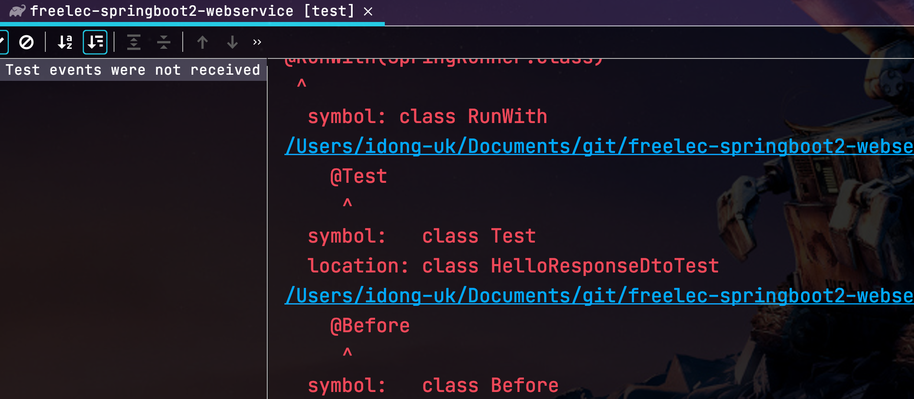
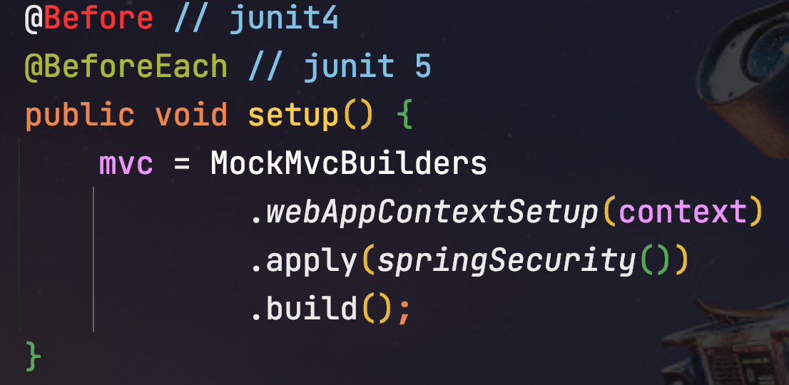

# 스프링 부트와 AWS로 혼자 구현하는 웹 서비스 (2020.12.16)

작년 11월 말에 [스프링 부트와 AWS로 혼자 구현하는 웹 서비스](https://jojoldu.tistory.com/463)를 출판 하였습니다.  
  
Spring Boot가 2.1 -> 2.4로, IntelliJ IDEA가 2019 -> 2020으로 오면서 너무 많은 변화가 있다보니, 집필할 때와 비교해 실습에서 지속적으로 문제를 제보 받았습니다.  
  
* 실무에서 사용할때는 쉽게 버전을 올릴순 없지만, 책을 통한 학습단계에서는 웬만해선 최신 버전을 사용하신다는 점
* 실습 도구들의 버전업이 너무 빠르게 이루어졌다는 점

2가지가 생각보다 크게 다가와서 한번은 가장 최신 버전으로 코드를 정리해야겠다는 생각에 글을 쓰게 되었습니다.


> 물론 이렇게 작성된 글도 2021년에 Spring Boot 2.5, IntelliJ 2021로 버전업 되면서 크게 개편이 되면 또 이슈가 되리라 봅니다.  
> 그래서 도대체 어느 버전까지 개편을 지원해야하나? 라는 고민이 드는데요.  
> 일단은 해볼수 있을때까지는 해보겠습니다!

이 글은 기본적으로 [스프링 부트와 AWS로 혼자 구현하는 웹 서비스](https://jojoldu.tistory.com/463)를 기반으로 합니다.  
해당 저서에서 사용되는 라이브러리와 도구의 버전을 현재 (2020.12.16) 가장 최신 버전으로 변환하는 방법을 소개 합니다.  
  
변경될 도구들의 버전은 다음과 같습니다.

* Spring Boot 2.4.1
* Gradle 6.7.1
* IntelliJ IDEA 2020.3
* Junit5

> Mac을 중심으로 실습하다보니, 환경마다 또 다를수가 있습니다.  
> 이 글을 보시는 분들은 안되시는게 있으시면 댓글 남겨주시면 확인후에 답글 남기겠습니다.  
> 다행히 책이 아닌 인터넷 글이다보니, 실시간으로 본문 수정이 가능해서 언제든 본문은 수정될 수 있습니다.

해당 실습 코드는 [Github](https://github.com/jojoldu/freelec-springboot2-webservice/tree/version/2020-12-11)에 있으니 참고해서 진행해주시면 됩니다.

## 0. 기존에 구성했다면

이미 기존에 작성된 코드가 있으시다면 아래와 같이 Gradle의 버전을 올립니다.  

> 신규로 진행하신다면 프로젝트 생성된 뒤, Gradle Wrapper의 버전을 확인 후 진행합니다.
  
기존 프로젝트가 있는 디렉토리로 이동 하신뒤, 아래 명령어로 업데이트를 진행합니다.

```bash
gradlew wrapper --gradle-version 6.7.1
```

> Mac/Linux에서는 ```./gradlew```로, Windows에서는 ```gradlew```로 실행하시면 됩니다.


BUILD SUCCESSFUL이 되셨다면 아래와 같이 Gradle Wrapper 파일의 버전이 업데이트되었는지 확인합니다.


6.7.1로 나온다면 정상적으로 성공이니 다음으로 넘어갑니다.

## 1. build.gradle

프로젝트의 Gradle 버전을 6.7.1로 올렸으니 ```build.gradle```의 설정들도 Gradle6에 맞게 변경합니다.  
  
아래와 같이 전체 코드를 변경합니다.

```groovy
plugins { // (1)
    id 'org.springframework.boot' version '2.4.1' // RELEASE 삭제
    id 'io.spring.dependency-management' version '1.0.10.RELEASE'
    id 'java'
}

group 'com.jojoldu.book'
version '1.0.4-SNAPSHOT-'+new Date().format("yyyyMMddHHmmss")
sourceCompatibility = 1.8   

repositories {
    mavenCentral()
    jcenter()
}

// for Junit 5
test { // (2)
    useJUnitPlatform()
}

dependencies {
    //(3)
    implementation('org.springframework.boot:spring-boot-starter-web')
    implementation('org.springframework.boot:spring-boot-starter-mustache')

    // lombok
    implementation('org.projectlombok:lombok')
    annotationProcessor('org.projectlombok:lombok')
    testImplementation('org.projectlombok:lombok')
    testAnnotationProcessor('org.projectlombok:lombok')

    implementation('org.springframework.boot:spring-boot-starter-data-jpa')
    implementation("org.mariadb.jdbc:mariadb-java-client")
    implementation('com.h2database:h2')

    implementation('org.springframework.boot:spring-boot-starter-oauth2-client')
    implementation('org.springframework.session:spring-session-jdbc')

    testImplementation('org.springframework.boot:spring-boot-starter-test')
    testImplementation("org.springframework.security:spring-security-test")
}
```

(1) ```plugins{..}```
* Gradle 5부터는 Gradle Plugin 사용법에 변경이 있습니다.
* 같은 플러그인을 Gradle 버전에 맞춰 선언 방법이 달라지다보니 [Gradle Plugin 사이트](https://plugins.gradle.org/plugin/org.springframework.boot)에서 2가지 사용법을 모두 명시하고 있으니 버전에 맞춰 사용하시면 됩니다.


(2) ```test```
* Junit5를 사용하기 위해서는 필수로 선언되어야 합니다.

(3) ```implementation```, ```testImplementation```
* Gradle 6가 되면서 ```compile```, ```testCompile```은 **Soft Deprecate** 되었습니다.
* 그 대신 ```implementation```, ```testImplementation``` 가 추가되었습니다.
* 이에 대해서는 [기존에 작성된 글](https://jojoldu.tistory.com/538)을 참고해보시길 추천드립니다.

build.gradle 설정이 다되셨다면 전체 테스트를 한번 수행해봅니다.


그럼 아래와 같이 Test가 실패가 나는데요.  



이제 이 부분을 수정해보겠습니다.

## 2. Junit

깨진 테스트들의 이유는 Junit4의 코드를 5로 변환해야하기 때문인데요.  
  
프로젝트 전체에서 해당 코드들을 **전체 교체**하겠습니다.  
단축키는 다음과 같습니다.  
  
**Mac**

* CMD + Shift + R

**Windows/Linux**

* Ctrl + Shift + R

자 그럼 하나씩 변경해보겠습니다.

### 2-1. @Test

먼저 ```@Test```를 변경하는데, Junit4와 5는 **패키지 위치만 다를뿐** 이라서 import 코드만 교체하겠습니다.  


위에서 언급한 단축키를 통해 검색하신뒤, **ReplaceAll**을 클릭해 변환하시면 됩니다.

> 단축키가 잘 안되신다면 직접 코드를 열어서 수정하셔도 됩니다.


### 2-2 @RunWith

두번째는 ```@RunWith``` 입니다.  
해당 어노테이션의 경우 Junit5가 되면서 ```@ExtendWith```로 변경되었습니다.  
그래서 **어노테이션과 패키지위치** 2개다 변경이 필요합니다.


#### 어노테이션
  
**as-is**

```java
@RunWith
```

**to-be**

```java
@ExtendWith
```

#### import패키지
  
**as-is**

```java
org.junit.runner.RunWith
```

**to-be**

```java
org.junit.jupiter.api.extension.ExtendWith
```

### 2-3. SpringRunner

3번째는 ```@SpringRunner``` 입니다.  
앞서 ```@RunWith```와 마찬가지로 ```@SpringRunner``` 역시 ```@SpringExtension``` 로 변경되었기 때문에 **어노테이션과 패키지 위치** 2개다 변경이 필요합니다.


#### 어노테이션
  
**as-is**

```java
@SpringRunner
```

**to-be**

```java
@SpringExtension
```

#### import패키지

**as-is**

```java
org.springframework.test.context.junit4.SpringRunner
```

**to-be**

```java
org.springframework.test.context.junit.jupiter.SpringExtension
```

### 2-4. @After

4번째는 테스트 메소드가 **끝날때마다** 수행되는 ```@After```입니다.  
마찬가지로 ```@After```가 역시 ```@AfterEach``` 로 변경되었기 때문에 **어노테이션과 패키지 위치** 2개다 변경이 필요합니다.

#### 어노테이션


**as-is**

```java
@After
```

**to-be**

```java
@AfterEach
```

#### import패키지


**as-is**

```java
org.junit.After
```

**to-be**

```java
org.junit.jupiter.api.AfterEach
```

### 2-5. @Before

마지막으로 ```@Before``` 입니다.  
After와 마찬가지로 ```@Before```가 역시 ```@BeforeEach``` 로 변경되었기 때문에 **어노테이션과 패키지 위치** 2개다 변경이 필요합니다.

**as-is**

```java
@Before
```

**to-be**

```java
@BeforeEach
```



#### import패키지


**as-is**

```java
org.junit.Before
```

**to-be**

```java
org.junit.jupiter.api.BeforeEach
```

### 2-6. 주의

테스트를 수행하는데 아래와 같이 에러가 발생한다면

```java
No tests found for given includes
```


build.gradle에 아래 옵션이 빠진건 아닌지 다시 build.gradle 옵션을 확인해봅니다.

```groovy
test {
    useJUnitPlatform()
}
```

Junit 관련된 모든 설정이 끝나셨으면 다시 테스트를 수행해봅니다.  
그럼 아래와 같이 SQL 쿼리가 정상적으로 수행이 되지 않아 몇개의 테스트가 실패 하는 것을 확인할 수 있습니다.


자 이부분을 수정해보겠습니다.

## 3. JPA

위 테스트의 실패 로그를 보시면 ```create table``` 쿼리가 H2에서 정상적으로 수행이 안되었기 때문임을 알 수 있는데요.  
  
이는 Spring Boot 2.1.10 부터 MySQL 문법 지정 방식에 변화가 있었기 때문인데요.  
  
그래서 DB 설정들의 변경이 필요합니다.  
  
현재 프로젝트는 다음과 같이 application.properties를 가지고 있는데요.  


local 용 파일들과 real용 파일들을 구분해서 수정하겠습니다.

> local용 파일이 결국 h2에 사용되기 때문입니다.

### 3-1. application.properties

application.properties 코드는 **2개 파일**을 수정해야합니다.  

* src/**main**/resources/application.properties
* src/**test**/resources/application.properties

둘다 로컬에서 **직접실행할때**와 **테스트로 실행**할때 사용되는 파일들이라 동일하게 수정합니다.

**as-is**

```properties
spring.jpa.properties.hibernate.dialect=org.hibernate.dialect.MySQL5InnoDBDialect
```

**to-be**

```properties
spring.jpa.properties.hibernate.dialect=org.hibernate.dialect.MySQL57Dialect
spring.jpa.properties.hibernate.dialect.storage_engine=innodb
spring.datasource.hikari.jdbc-url=jdbc:h2:mem:testdb;MODE=MYSQL
spring.datasource.hikari.username=sa
```

* ```spring.datasource.hikari.jdbc-url```
  * real-db를 사용할 경우 override 됩니다.
* ```spring.datasource.hikari.username```
  * real-db를 사용할 경우 override 됩니다.

이렇게 변경하신뒤, 아래와 같이 ```localhost:8080/h2-console```로 접속하셔서 정상적으로 h2 웹 콘솔로 접속이 되는지 확인합니다.


### 3-2. application-real-db.properties

real용 DB 설정 파일인 application-real-db.properties는 다음과 같이 **설정path**의 변경이 있습니다.

* ex) ```spring.datasource.url``` -> ```spring.datasource.hikari.jdbc-url```

아래와 같이 설정 코드들을 변경합니다.

**as-is**

```properties
spring.jpa.hibernate.ddl-auto=none

spring.datasource.url=jdbc:mariadb://rds주소:포트명(기본은 3306)/database명
spring.datasource.username=db계정
spring.datasource.password=db계정 비밀번호
spring.datasource.driver-class-name=org.mariadb.jdbc.Driver
```

**to-be**

```properties
spring.jpa.hibernate.ddl-auto=none
spring.jpa.show_sql=false

spring.datasource.hikari.jdbc-url=jdbc:mariadb://rds주소:포트명(기본은 3306)/database명
spring.datasource.hikari.username=db계정
spring.datasource.hikari.password=db계정 비밀번호
spring.datasource.hikari.driver-class-name=org.mariadb.jdbc.Driver
```

여기까지 다 되신분들은 다시 한번 전체 테스트를 수행해봅니다.


> 테스트 코드가 있으니 버전업 이후 기능에 대해서 검증이 편하신게 느껴지신다면 제 책의 의도가 50% 이상은 성공했다고 생각합니다.

## 마무리

끝까지 따라오시느라 고생하셨습니다.  
  
여기서 주의할 점은, 이렇게 작성된 글 역시 **시간이 흐르면 정상 작동하지 않을 것**이란 점입니다.  
모든 개발 도구들은 버전업을 합니다.  
  
특히나 요즘은 분기(3개월)마다 거의 주요 버전들을 올리곤 하는데요.  
언제든 안될 수 있기 때문에 여러분이 익히셔야하는것들은, **왜 안되는지 로그를 보고 검색**하는 습관입니다.  
  
처음 실습을 진행하셔서 성공하셨다면, 해당 코드들을 가지고 지속적으로 라이브러리와 도구를 버전업하면서 왜 버전업하면 안되는지 고쳐나가는 것도 좋은 공부 방법이라 생각합니다.  
  
이번 포스팅이 그런 연습에 도움이 되시길 바래봅니다.