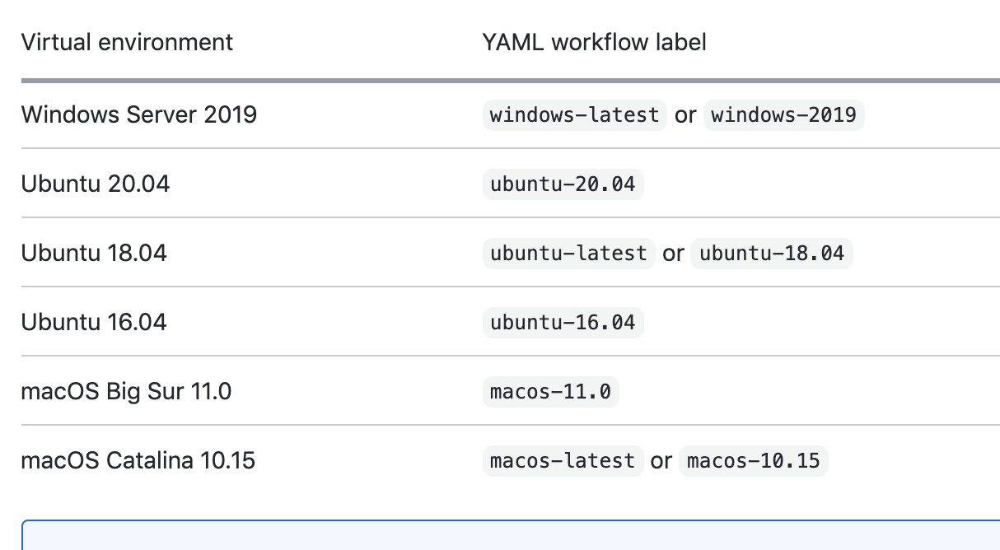
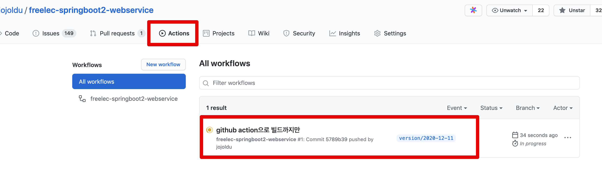
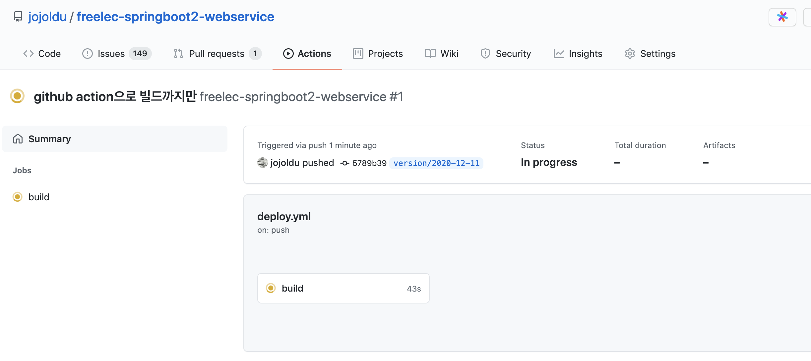
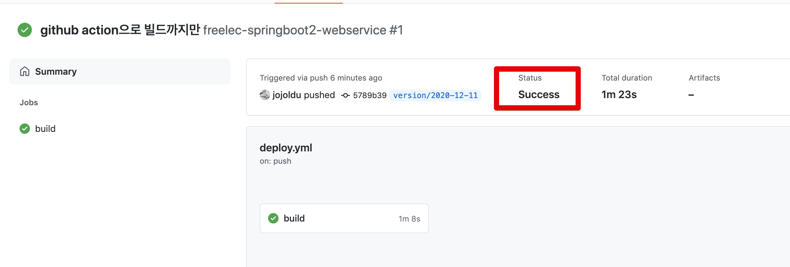

# 1. Github Action & AWS Beanstalk 배포하기 - Github Action으로 빌드하기

기존에 사이드 프로젝트를 만들면 다음과 같은 환경에서 진행을 해왔습니다.  
  
1. TravisCI & AWS Code Deploy
2. TravisCI & AWS Beanstalk

상황에 따라 골라 쓰긴 했지만, 큰 불편함이 없었는데요.  
최근 대세가 TravisCI에서 Github Action으로 넘어갔음이 느껴져 Github Action과 Beanstalk 조합에 대한 글을 쓰게 되었습니다.


> Github Action & AWS Code Deploy 조합은 [wbluke님의 시리즈](https://wbluke.tistory.com/39)를 참고해주시면 됩니다.

AWS Beanstalk의 경우 최근 버전업을 하면서 몇몇 설정들에는 변경도 있었어서 해당 설정들을 다시 정리할 수 있었습니다.  
  
혹시나 [제 저서](https://jojoldu.tistory.com/463)를 보고 AWS Code Deploy를 사용해오셨다면, 좀 더 편하게 서버를 배포할 수 있는 AWS Beanstalk을 이번 기회로 한번 배워보시길 바래봅니다.

> 여기서 사용되는 모든 **애플리케이션 코드** (Java & Gradle)는 저의 저서 [스프링 부트와 AWS로 혼자 구현하는 웹 서비스](https://jojoldu.tistory.com/463)를 기반으로 합니다.  

전체적인 구조는 다음과 같습니다.


CodeDeploy를 사용하던것과 달리 Beanstalk을 사용하면 **구현상에 깔끔한 구조**가 가능한데요.

* 배포파일전송을 위해 S3에 업로드 하는 과정이 없습니다.
* EC2에 배포를 위해 별도의 agent 설치가 필요가 없습니다.
* Nginx설치 / OS 설정 등 OS상에 필요한 모든 설정은 **코드로 관리**가 가능합니다.

Beanstalk의 소개와 장점에 대해서는 이후에 좀 더 자세히 설명드릴것을 약속드리고, 바로 Github Action 설정으로 가보겠습니다.

## 1-1. Github Action으로 Build 하기


[OS](https://docs.github.com/en/free-pro-team@latest/actions/reference/workflow-syntax-for-github-actions#jobsjob_idruns-on)



```yaml
name: freelec-springboot2-webservice

on:
  push:
    branches:
      - version/2020-12-11 # 일반적으로는 master로 함 (저는 별도 브랜치로 지정)
  workflow_dispatch: # 수동 실행

jobs:
  build:
    runs-on: ubuntu-latest

    steps:
      - name: Checkout
        uses: actions/checkout@v2

      - name: Set up JDK 1.8
        uses: actions/setup-java@v1
        with:
          java-version: 1.8

      - name: Grant execute permission for gradlew
        run: chmod +x ./gradlew
        shell: bash

      - name: Build with Gradle
        run: |
          ./gradlew clean build
        shell: bash

```







## IAM 인증키 발급받기

## IAM 인증키 Github Action에서 사용하기

책 p.239에서 설정한 보안그룹을 선택합니다.


```yaml
- name: Deploy to EB
    uses: einaregilsson/beanstalk-deploy@v14
    with:
    aws_access_key: ${{ secrets.AWS_ACCESS_KEY_ID }}
    aws_secret_key: ${{ secrets.AWS_SECRET_ACCESS_KEY }}
    application_name: MyApplicationName
    environment_name: MyApplication-Environment
    version_label: 12345
    region: ap-northeast-2
    deployment_package: deploy.zip
```

```yaml
name: freelec-springboot2-webservice

on:
  push:
    branches:
      - version/2020-12-11 # push되면 실행될 브랜치를 선택합니다. ex) master (저는 version/2020-12-11 브랜치로 지정)
  workflow_dispatch: # 수동 실행

jobs:
  build:
    runs-on: ubuntu-latest
    steps:
        - name: Checkout
            uses: actions/checkout@v2

        - name: Set up JDK 1.8
            uses: actions/setup-java@v1.4.3
            with:
            java-version: 1.8

        - name: Grant execute permission for gradlew
            run: chmod +x ./gradlew
            shell: bash

        - name: Build with Gradle
            run: ./gradlew clean build
            shell: bash

        - name: Generate deployment package
            run: |
            mkdir -p deploy
            cp build/libs/*.jar deploy/application.jar
            cp Procfile deploy/Procfile
            cp -r .ebextensions deploy/.ebextensions
            cd deploy && zip -r deploy.zip .

        - name: Deploy to EB
            uses: einaregilsson/beanstalk-deploy@v14
            with:
            aws_access_key: ${{ secrets.AWS_ACCESS_KEY_ID }}
            aws_secret_key: ${{ secrets.AWS_SECRET_ACCESS_KEY }}
            application_name: MyApplicationName
            environment_name: MyApplication-Environment
            version_label: 12345
            region: ap-northeast-2
            deployment_package: deploy.zip
```


[](https://github.com/marketplace/actions/beanstalk-deploy)


```bash
vim /var/log/eb-engine.log
```