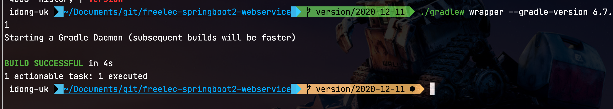
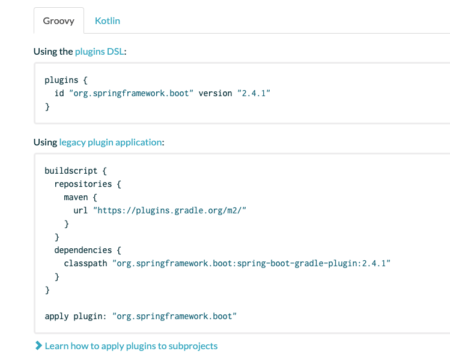

# 스프링 부트와 AWS로 혼자 구현하는 웹 서비스 (2020.12.12)

* Spring Boot 2.4.1
* Gradle 6.7.1
* IntelliJ IDEA 2020.3
* Junit5

## 0. 기존에 구성했다면

이미 기존에 작성된 코드가 있으시다면 아래와 같이 Gradle의 버전을 올립니다.  

> 신규로 진행하신다면 프로젝트 생성된 뒤, Gradle Wrapper의 버전을 확인 후 진행합니다.
  
기존 프로젝트가 있는 디렉토리로 이동 하신뒤, 아래 명령어로 업데이트를 진행합니다.

```bash
gradlew wrapper --gradle-version 6.7.1
```

> Mac/Linux에서는 ```./gradlew```로, Windows에서는 ```gradlew```로 실행하시면 됩니다.



BUILD SUCCESSFUL이 되셨다면 아래와 같이 Gradle Wrapper 파일의 버전이 업데이트되었는지 확인합니다.


6.7.1로 나온다면 정상적으로 성공이니 다음으로 넘어갑니다.

## 1. build.gradle

프로젝트의 Gradle 버전을 6.7.1로 올렸으니 ```build.gradle```의 설정들도 Gradle6에 맞게 변경합니다.  
  
아래와 같이 전체 코드를 변경합니다.

```groovy
plugins { // (1)
    id 'org.springframework.boot' version '2.4.1' // RELEASE 삭제
    id 'io.spring.dependency-management' version '1.0.10.RELEASE'
    id 'java'
}

group 'com.jojoldu.book'
version '1.0.4-SNAPSHOT-'+new Date().format("yyyyMMddHHmmss")
sourceCompatibility = 1.8   

repositories {
    mavenCentral()
    jcenter()
}

// for Junit 5
test { // (2)
    useJUnitPlatform()
}

dependencies {
    //(3)
    implementation('org.springframework.boot:spring-boot-starter-web')
    implementation('org.springframework.boot:spring-boot-starter-mustache')

    // lombok
    implementation('org.projectlombok:lombok')
    annotationProcessor('org.projectlombok:lombok')
    testImplementation('org.projectlombok:lombok')
    testAnnotationProcessor('org.projectlombok:lombok')

    implementation('org.springframework.boot:spring-boot-starter-data-jpa')
    implementation("org.mariadb.jdbc:mariadb-java-client")
    implementation('com.h2database:h2')

    implementation('org.springframework.boot:spring-boot-starter-oauth2-client')
    implementation('org.springframework.session:spring-session-jdbc')

    testImplementation('org.springframework.boot:spring-boot-starter-test')
    testImplementation("org.springframework.security:spring-security-test")
}
```

(1) ```plugins{..}```
* Gradle 5부터는 Gradle Plugin 사용법에 변경이 있습니다.
* 같은 플러그인을 Gradle 버전에 맞춰 선언 방법이 달라지다보니 [Gradle Plugin 사이트](https://plugins.gradle.org/plugin/org.springframework.boot)에서 2가지 사용법을 모두 명시하고 있으니 버전에 맞춰 사용하시면 됩니다.



(2) ```test```
* Junit5를 사용하기 위해서는 필수로 선언되어야 합니다.

(3) ```implementation```, ```testImplementation```
* Gradle 6가 되면서 ```compile```, ```testCompile```은 **Soft Deprecate** 되었습니다.
* 그 대신 ```implementation```, ```testImplementation``` 가 추가되었습니다.
* 이에 대해서는 [기존에 작성된 글](https://jojoldu.tistory.com/538)을 참고해보시길 추천드립니다.

build.gradle 설정이 다되셨다면 전체 테스트를 한번 수행해봅니다.


그럼 아래와 같이 Test가 실패가 나는데요.  


이제 이 부분을 수정해보겠습니다.

## 2. Junit

Mac

* CMD + Shift + R

Windows/Linux

* Ctrl + Shift + R

**ReplaceAll**


### @Test

### @RunWith

### SpringRunner

**as-is**

```java
org.springframework.test.context.junit4.SpringRunner
```

**to-be**

```java
org.springframework.test.context.junit.jupiter.SpringExtension
```

### @After

### @Before

```java
org.junit.Before
```

```java
org.junit.jupiter.api.BeforeEach
```

### 주의

테스트를 수행하는데 아래와 같이 에러가 발생한다면

```java
No tests found for given includes
```


build.gradle에 아래 옵션이 빠진건 아닌지 다시 build.gradle 옵션을 확인해봅니다.

```groovy
test {
    useJUnitPlatform()
}
```

## JPA


### application.properties

**as-is**

```properties
spring.jpa.properties.hibernate.dialect=org.hibernate.dialect.MySQL5InnoDBDialect
```

**to-be**

```properties
spring.jpa.properties.hibernate.dialect=org.hibernate.dialect.MySQL57Dialect
spring.jpa.properties.hibernate.dialect.storage_engine=innodb
spring.datasource.hikari.jdbc-url=jdbc:h2:mem:testdb;MODE=MYSQL
spring.datasource.hikari.username=sa
```

* ```spring.datasource.hikari.jdbc-url```
  * real-db를 사용할 경우 override 됩니다.

### application-real-db.properties

**as-is**

```properties
spring.jpa.hibernate.ddl-auto=none

spring.datasource.url=jdbc:mariadb://rds주소:포트명(기본은 3306)/database명
spring.datasource.username=db계정
spring.datasource.password=db계정 비밀번호
spring.datasource.driver-class-name=org.mariadb.jdbc.Driver
```

**to-be**

```properties
spring.jpa.hibernate.ddl-auto=none
spring.jpa.show_sql=false

spring.datasource.hikari.jdbc-url=jdbc:mariadb://rds주소:포트명(기본은 3306)/database명
spring.datasource.hikari.username=db계정
spring.datasource.hikari.password=db계정 비밀번호
spring.datasource.hikari.driver-class-name=org.mariadb.jdbc.Driver
```