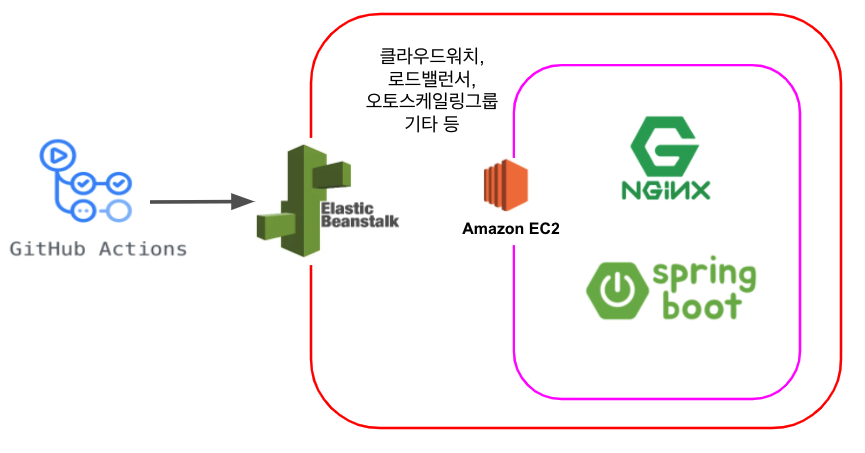
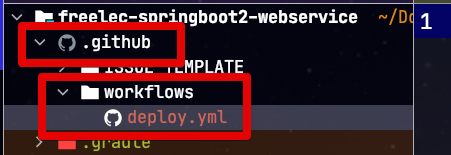
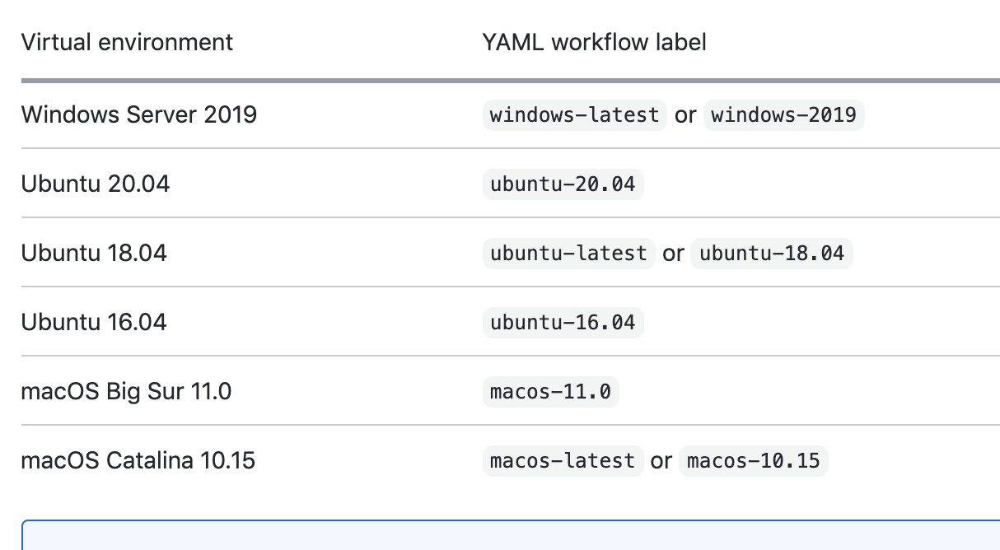
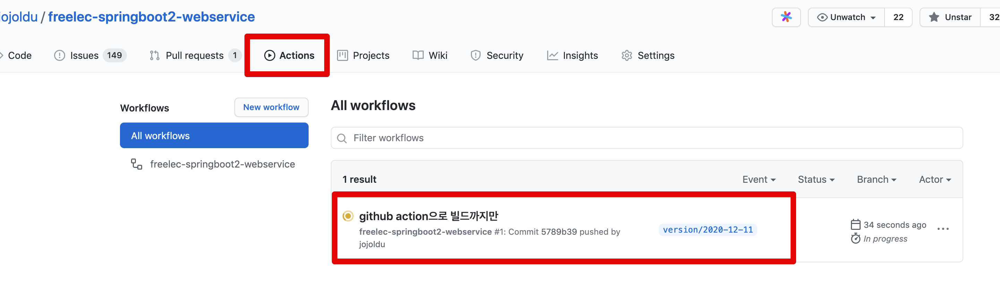
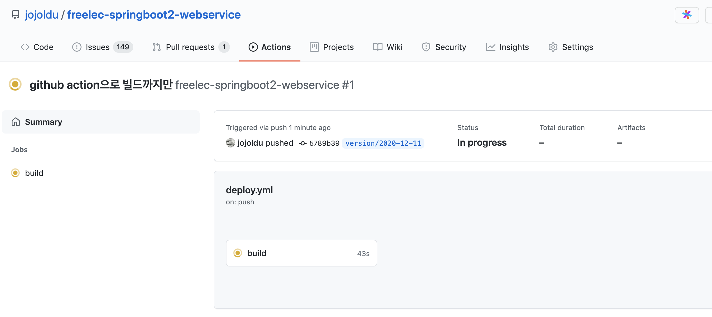
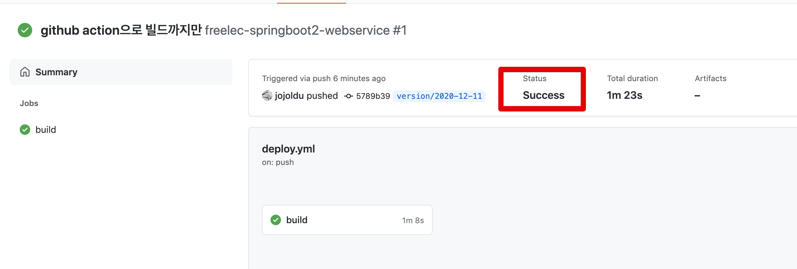
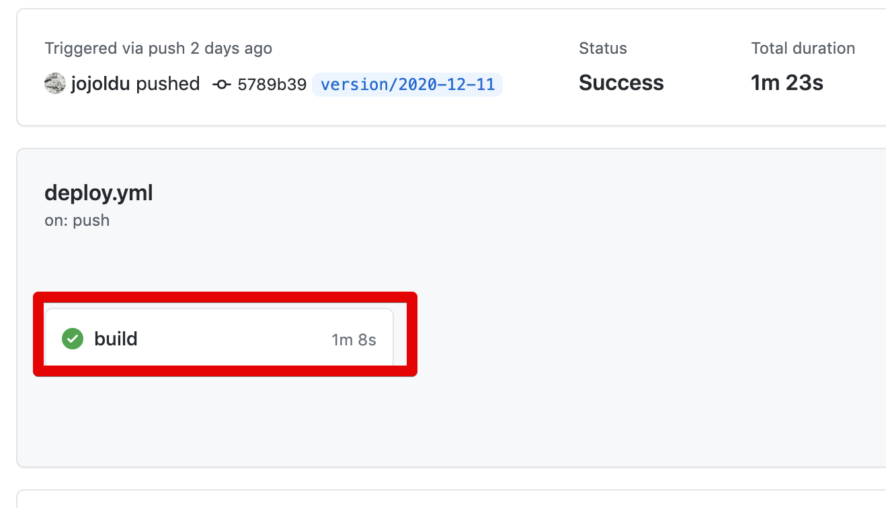
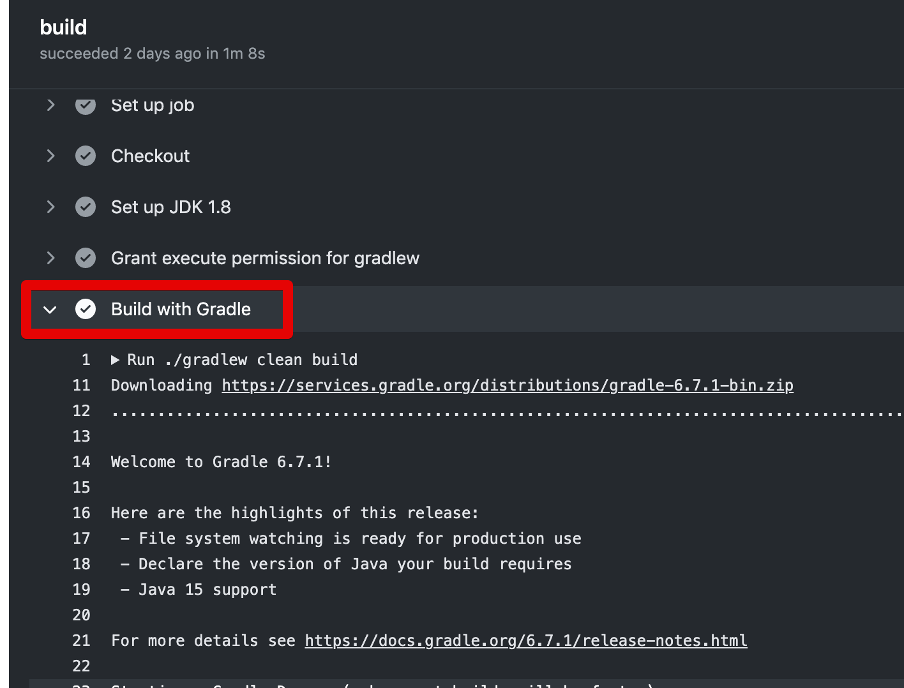
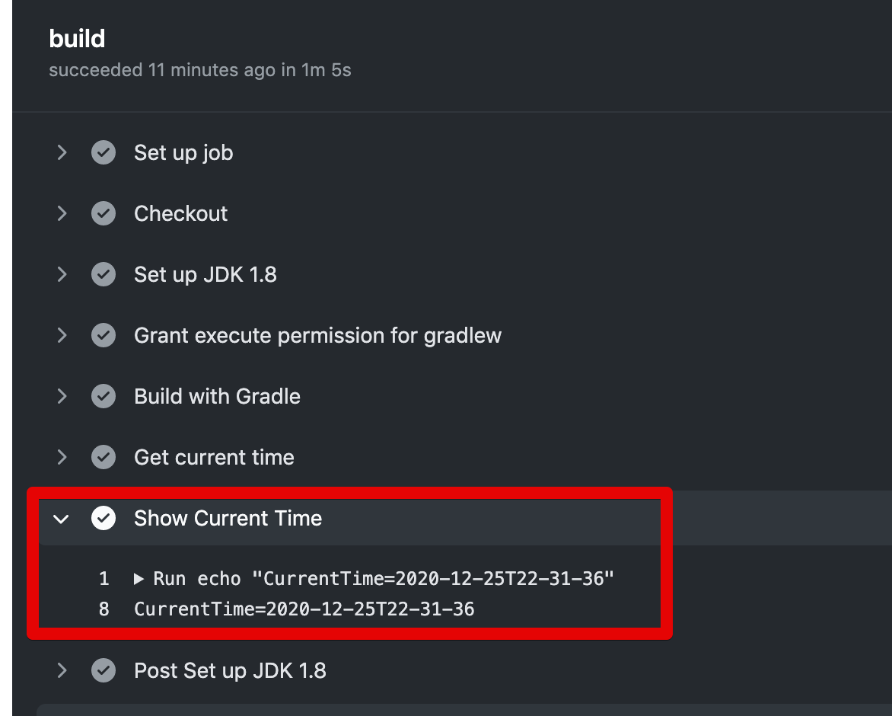

# 1. Github Action & AWS Beanstalk 배포하기 - Github Action으로 빌드하기

기존에 사이드 프로젝트를 만들면 다음과 같은 환경에서 진행을 해왔습니다.  
  
1. TravisCI & AWS Code Deploy
2. TravisCI & AWS Beanstalk

상황에 따라 골라 쓰긴 했지만, 큰 불편함이 없었는데요.  
최근 대세가 TravisCI에서 Github Action으로 넘어갔음이 느껴져 Github Action과 Beanstalk 조합에 대한 글을 쓰게 되었습니다.


> Github Action & AWS Code Deploy 조합은 [wbluke님의 시리즈](https://wbluke.tistory.com/39)를 참고해주시면 됩니다.

AWS Beanstalk의 경우 최근 버전업을 하면서 몇몇 변경된 설정들이 있어서 해당 부분 역시 다시 정리할 수 있었습니다.  
  
혹시나 [제 저서](https://jojoldu.tistory.com/463)를 보고 AWS Code Deploy를 사용해오셨다면, 좀 더 편하게 서버를 배포할 수 있는 AWS Beanstalk을 이번 기회로 한번 배워보시길 바래봅니다.

> 여기서 사용되는 모든 **애플리케이션 코드** (Java & Gradle)는 저의 저서 [스프링 부트와 AWS로 혼자 구현하는 웹 서비스](https://jojoldu.tistory.com/463)를 기반으로 합니다.  

전체적인 구조는 다음과 같습니다.



CodeDeploy를 사용하던것과 달리 Beanstalk을 사용하면 **구현상에 깔끔한 구조**가 가능한데요.

* 배포파일전송을 위해 S3에 업로드 하는 과정이 없습니다.
* EC2에 배포를 위해 별도의 agent 설치가 필요가 없습니다.
* Nginx설치 / OS 설정 등 OS상에 필요한 모든 설정은 **코드로 관리**가 가능합니다.

Beanstalk의 소개와 장점에 대해서는 이후에 좀 더 자세히 설명드릴것을 약속드리고, 바로 Github Action 설정으로 가보겠습니다.

이 과정은 3개로 진행됩니다.

1. Github Action으로 기본적인 Build하기
2. Github Action으로 AWS Beanstalk에 local profile로 배포하기
3. Github Action으로 AWS Beanstalk에 real profile로 배포하기

## 1-1. Github Action yml 파일 생성하기

Github 웹 사이트에서 템플릿을 만들어도 되지만, 굳이 필수 작업은 아니기에, 현재 프로젝트에서 바로 템플릿을 만들어 보겠습니다.  
  
아래와 같이 프로젝트 디렉토리에서 ```.github/workflows``` 디렉토리를 생성하고, 거기에 ```deploy.yml```을 만들어봅니다.



> 위 처럼 github 아이콘으로 노출되길 원하시면 [extra-icons 플러그인](https://plugins.jetbrains.com/plugin/11058-extra-icons)을 설치하시면 됩니다.

해당 파일에는 아래와 같이 코드를 작성해봅니다.

```yaml
name: freelec-springboot2-webservice

on:
  push:
    branches:
      - version/2020-12-11 # (1) 실습하시는분들은 master로 하시면 됩니다. (저는 별도 브랜치로 지정)
  workflow_dispatch: # (2) 수동 실행

jobs:
  build:
    runs-on: ubuntu-latest # (3)

    steps:
      - name: Checkout
        uses: actions/checkout@v2 # (4)

      - name: Set up JDK 1.8
        uses: actions/setup-java@v1 # (5)
        with:
          java-version: 1.8

      - name: Grant execute permission for gradlew
        run: chmod +x ./gradlew # (6)
        shell: bash

      - name: Build with Gradle
        run: ./gradlew clean build # (7)
        shell: bash

```

(1) ```on: push: branches: - version/2020-12-11```

* 현재 만드는 Github Action의 **트리거 브랜치**를 지정합니다.
* 즉, 여기서는 ```version/2020-12-11```브랜치가 push되면 현재 만들고 있는 Github Action이 실행됩니다.
* ```master``` 브랜치가 트리거가 되길 원하시면 ```master```를 등록하시면 됩니다.

(2) ```on: workflow_dispatch:```

* 브랜치 push 이벤트외에, **수동으로 실행**하는 것도 가능하게 만드는 옵션입니다.

(3) ```jobs: build: runs-on: ubuntu-latest```

* 해당 Github Action 스크립트가 작동될 OS 환경을 지정합니다.
* 일반적으로 웹 서비스의 OS는 Ubuntu 보다는 Centos를 많이들 쓰기 때문에 Centos는 없을까 생각해보실텐데요.
* 아쉽게도 Github Action에서 공식지원하는 [OS 목록](https://docs.github.com/en/free-pro-team@latest/actions/reference/workflow-syntax-for-github-actions#jobsjob_idruns-on)에는 Centos가 없으니 Ubuntu를 사용합니다.



(4) ```uses: actions/checkout@v2```

* 프로젝트 코드를 checkout 합니다.

(5) ```actions/setup-java@v1```

* Github Action이 실행될 OS에 Java를 설치합니다.
* ```with: java-version: 1.8``` 로 메이저 버전을 설치할 수 있으며 11, 13 등 버전들도 설치 가능합니다.
* 자세한건 [마켓플레이스 Action](https://github.com/marketplace/actions/setup-java-jdk)을 참고하시면 좋습니다.

(6) ```run: chmod +x ./gradlew```

* gradle wrapper를 실행할 수 있도록 실행 권한 (```+x```)을 줍니다.
* 해당 실행 권한이 있어야 아래 (7) 를 실행할 수 있습니다.

(7) ```run: ./gradlew clean build```

* gradle wrapper를 통해 해당 프로젝트를 build 합니다.

파일 생성이 끝나셨으면, Github으로 Push를 실행해봅니다.

## 1-2. Github Action 빌드하기

Github으로 Push를 하셨다면 Github 저장소로 갑니다.  
Github 저장소 -> Actions 탭 -> 방금 push 한 flow를 클릭합니다.



그럼 아래와 같이 build가 진행되는 것을 볼 수 있습니다.



build가 끝나면, 아래처럼 status가 Success를 볼 수 있습니다.



만약 workflow의 로그를 보고 싶으시면 build 버튼을 클릭합니다.



그럼 아래와 같이 각 job 별로 로그를 확인할 수 있습니다.



자 여기까지하면 Github Action을 이용한 Build 단계가 성공한 것입니다.

## 1-3. Github Action에 Time Action 추가하기

다음 단계를 위해서 한가지 job을 추가해볼텐데요.  
build 시점의 **현재 시간**을 확인하는 기능입니다.  

> 다음 포스팅에서 build 파일명에 현재시간을 추가하기 위함입니다.

추가할 코드는 아래와 같습니다.  

```yaml
- name: Get current time
  uses: 1466587594/get-current-time@v2 
  id: current-time
  with:
    format: YYYY-MM-DDTHH-mm-ss # (1)
    utcOffset: "+09:00"

- name: Show Current Time
  run: echo "CurrentTime=${{steps.current-time.outputs.formattedTime}}" # (2)
  shell: bash
```

(1) ```with: format: YYYY-MM-DDTHH-mm-ss```

* ```1466587594/get-current-time``` action의 경우 기존의 [Momentjs](https://momentjs.com/docs/#/displaying/format/)을 지원하기 때문에 동일한 포맷을 사용하면 됩니다.
* ```utcOffset: "+09:00"```: 해당 action의 기준이 UTC이기 때문에 한국시간이 KST를 맞추기 위해서는 +9시간이 필요하여 offset을 추가합니다.

(2) ```${{steps.current-time.outputs.formattedTime}}```

* (1)의  ```get-current-time``` 에서 **지정한 포맷대로 현재 시간**을 노출하게 됩니다.

이렇게 해서 위 코드까지 포함하게 되면 전체 ```deploy.yml```은 다음과 같이 됩니다.

```yaml
name: freelec-springboot2-webservice

on:
  push:
    branches:
      - version/2020-12-11  # push되면 실행될 브랜치를 선택합니다.
                            # ex) master (저는 version/2020-12-11 브랜치로 지정)
  workflow_dispatch: # 수동 실행

jobs:
  build:
    runs-on: ubuntu-latest
    steps:
      - name: Checkout
        uses: actions/checkout@v2

      - name: Set up JDK 1.8
        uses: actions/setup-java@v1.4.3
        with:
          java-version: 1.8

      - name: Grant execute permission for gradlew
        run: chmod +x ./gradlew
        shell: bash

      - name: Build with Gradle
        run: ./gradlew clean build
        shell: bash

      - name: Get current time
        uses: 1466587594/get-current-time@v2
        id: current-time
        with:
          format: YYYY-MM-DDTHH-mm-ss
          utcOffset: "+09:00"

      - name: Show Current Time
        run: echo "CurrentTime=${{steps.current-time.outputs.formattedTime}}"
        shell: bash
```

이렇게 수정 후, Github에 Push하시고 다시 Github 로그를 보시면 현재 시간이 포맷대로 노출되는 것을 확인할 수 있습니다.



## 1-4. 마무리

첫번째로 Github Action으로 Build 단계를 진행해보았습니다.  
다음 시간에는 이번에 만든 Github Action과 AWS Beanstalk을 연동해보겠습니다.

