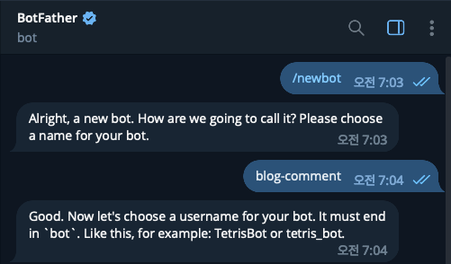
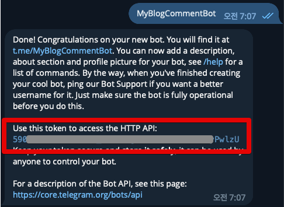
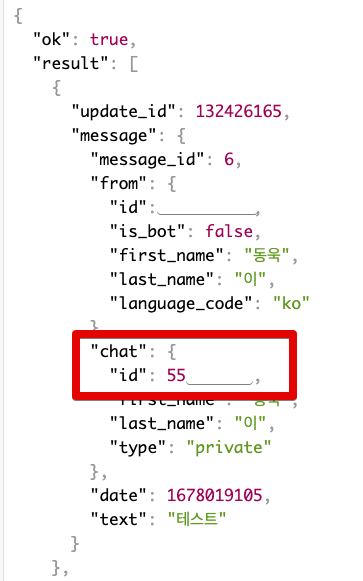
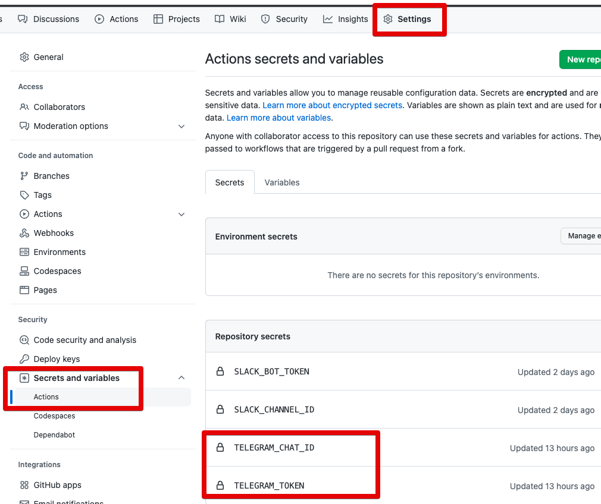
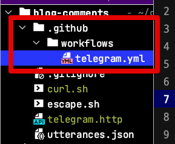
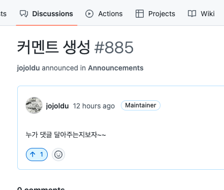
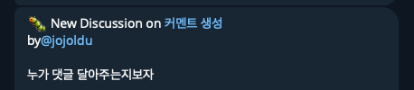
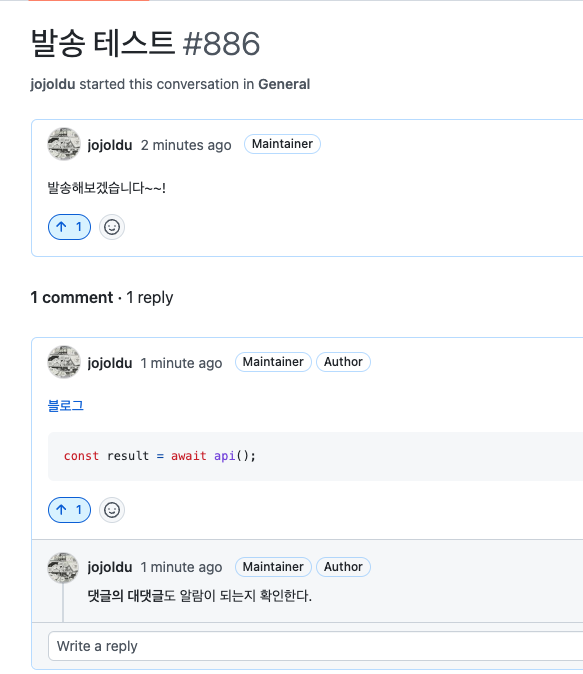
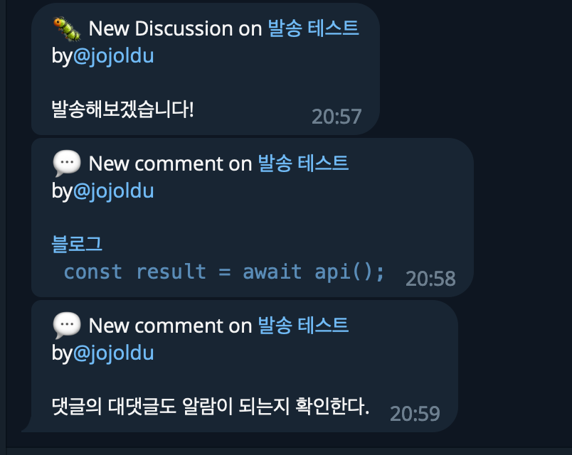

# Giscus 댓글, 텔레그램 (Telegram) 으로 알람 받기

최근에 Giscus로 댓글 시스템을 이관하면서 새 댓글이 생성될때 알람을 받을 방법이 없었다.  
그래서 간단하게 Github Action과 Telegram을 통해 알람을 받도록 구성했다.

## 1. 텔레그램 Bot 생성

[BotFather](https://telegram.me/BotFather) 에서 새로운 봇을 생성한다.



- `/newbot` 을 입력해서 새로운 봇 생성을 시작
- `blog-comment` 라는 이름으로 봇 생성



- 방금전에 생성한 `blog-comment` 봇의 username을 지어야한다.
  - 여기서는 `MyBlogCommentBot` 으로 지었다.
  - 마지막엔 꼭 bot이 붙어야 한다.
- 마지막 메세지에 포함된 token 값이 앞으로 사용할 Token이라 별도로 관리를 한다.

해당 Bot의 채널ID를 알아야 API를 사용할 수 있다.  
chatId를 확인해보기 위해 생성된 Bot 채널로 가서 간단하게 메세지를 하나 보낸다.


메세지가 정상적으로 전송되었으면 아래 URL로 chatId 를 확인할 수 있다.

```bash
https://api.telegram.org/bot토큰/getUpdates
```
- `토큰` 자리에 위에서 발급한 Token 을 넣으면 된다.



Bot의 Token과 ChatId를 발급 받았으니 실제로 해당 값들로 메세지 전송이 가능한지 확인해본다.

```bash
curl -X POST "https://api.telegram.org/bot토큰/sendMessage?parse_mode=MarkdownV2" \
     -H "Content-Type: application/json" \
     -d '{"chat_id": "발급받은 ChatId", "disable_web_page_preview": true, "text": "`const a = api()` 잘가냐"}'
```

- `parse_mode=MarkdownV2`
  - 메세지를 해석할 모드를 선택한다
  - 여기선 최신 Markdown 문법을 지원하도록 선택한다.
- `"disable_web_page_preview": true`
  - 메세지에 있는 링크의 Preview를 disable 한다.
  - 알람의 경우 매번 preview가 보이면 채팅창이 너무 지저분해져서 disable 시킨다.
- `text`
  - 전송할 메세지
  - 마크다운 문법을 이용해서 전달해도 문제가 없는지 확인한다.

터미널로 `curl` 을 실행해서 다음과 같이 Bot에 메세지가 전송되면 성공이다.


## 2. Github Action 생성

위에서 테스트해본 `curl` 을 **Discussion 이 생성되고 댓글이 될때마다 실행**하도록 Github Action을 구성만 하면 된다.  
  
### 2-1. 환경 설정

Giscus를 설치한 본인의 Github 저장소로 가서 Telegram Token과 chatId를 secret key에 등록한다.  
  
**Settings** -> **Secrets and variables** -> **Actions**



등록된 Key와 테스트했던 URL을 이용해서 프로젝트에 Github Action 파일을 생성한다.



먼저 Discussions가 생성될때에 대한 코드를 작성해본다.

### 2-2. 토론 생성 알람

```yml
name: GitHub Discussions Notifier

on:
  discussion:
    types: [created]
  discussion_comment:
    types: [created]


jobs:
  send-create-discussion:
    runs-on: ubuntu-latest
    steps:
      - name: Create Message
        if: ${{ github.event.discussion && !github.event.comment }}
        id: create-message
        run: |
          string='🐛 New Discussion on [${{ env.DISCUSSION_TITLE }}](${{ env.DISCUSSION_URL }}) \nby[@${{ env.USER_NAME }}](${{ env.USER_URL }}) \n\n${{ env.DISCUSSION_BODY }}"'
          escaped_string=$(echo $string | sed 's/\([.!-]\)/\\\\\1/g')
          echo ${escaped_string}
          echo "MESSAGE_BODY=${escaped_string}" >> $GITHUB_OUTPUT
        env:
          DISCUSSION_URL: ${{ github.event.discussion.html_url }}
          DISCUSSION_TITLE: ${{ github.event.discussion.title }}
          DISCUSSION_BODY: ${{ github.event.discussion.body }}
          USER_URL: ${{ github.event.discussion.user.html_url }}
          USER_NAME: ${{ github.event.discussion.user.login }}
      - name: Send Discussion Create Notification to Telegram
        run: |
          curl -X POST "https://api.telegram.org/bot${{secrets.TELEGRAM_TOKEN}}/sendMessage?parse_mode=MarkdownV2" \
               -H "Content-Type: application/json" \
               -d '{"chat_id": "${{secrets.TELEGRAM_CHAT_ID}}", "disable_web_page_preview": true, "text": "${{ steps.create-message.outputs.MESSAGE_BODY }}"'
        shell: bash
```

- `if: ${{ github.event.discussion && !github.event.comment }}`
  - Discussion에 대한 Event이면서 Comment가 아닌 경우 실행된다.
- `escaped_string=$(echo $string | sed 's/\([.!-]\)/\\\\\1/g')` 
  - Telegram은 `.` 등 일부 특수문자에 대한 `escape` 처리가 필요하다.
  - 이를 처리한 후 output인 `MESSAGE_BODY` 에 저장해서 실제 메세지 보낼때 escape 처리된 결과를 사용한다.
- `env`
  - Github의 `event` 변수가 너무 길어 환경 변수로 이들을 치환해서 `run`에서 사용한다.

yml 파일이 모두 생성되었으면 Github에 Push 하고 실제로 Discussions을 하나 만들어서 정상적으로 알람이 오는지 확인 한다.



토론이 생성되면 알람이 온다.



### 2-3. 토론 댓글 알람

토론 생성에 대한 알람이 정상적으로 수행되었다면, 해당 코드를 응용해서 댓글과 대댓글에 대한 알람도 추가한다.

- 블로그 기준에서는 위에서 생성한 토론 생성에 대한 알람은 불필요할 수 있다.
- 토론은 블로그에 첫 댓글이 달릴때만 알람이 오는 것인데, 개인적으로 첫 댓글에 대해서는 좀 더 의미를 부여해도 된다고 생각하는 편이다.

기존에 만들어둔 yml 파일에 댓글에 대한 조건까지 추가하여 **전체 코드**는 다음과 같이 된다.

```yml
name: GitHub Discussions Notifier

on:
  discussion:
    types: [created]
  discussion_comment:
    types: [created]


jobs:
  send-create-discussion:
    runs-on: ubuntu-latest
    steps:
      - name: Create Message
        if: ${{ github.event.discussion && !github.event.comment }}
        id: create-message
        run: |
          string='🐛 New Discussion on [${{ env.DISCUSSION_TITLE }}](${{ env.DISCUSSION_URL }}) \nby[@${{ env.USER_NAME }}](${{ env.USER_URL }}) \n\n${{ env.DISCUSSION_BODY }}"'
          escaped_string=$(echo $string | sed 's/\([.!-]\)/\\\\\1/g')
          echo ${escaped_string}
          echo "MESSAGE_BODY=${escaped_string}" >> $GITHUB_OUTPUT
        env:
          DISCUSSION_URL: ${{ github.event.discussion.html_url }}
          DISCUSSION_TITLE: ${{ github.event.discussion.title }}
          DISCUSSION_BODY: ${{ github.event.discussion.body }}
          USER_URL: ${{ github.event.discussion.user.html_url }}
          USER_NAME: ${{ github.event.discussion.user.login }}
      - name: Send Discussion Create Notification to Telegram
        run: |
          curl -X POST "https://api.telegram.org/bot${{secrets.TELEGRAM_TOKEN}}/sendMessage?parse_mode=MarkdownV2" \
               -H "Content-Type: application/json" \
               -d '{"chat_id": "${{secrets.TELEGRAM_CHAT_ID}}", "disable_web_page_preview": true, "text": "${{ steps.create-message.outputs.MESSAGE_BODY }}"'
        shell: bash
  send-create-comment:
    runs-on: ubuntu-latest
    steps:
      - name: Create Comment Message
        if: ${{ github.event.discussion && github.event.comment }}
        id: create-comment-message
        run: |
          string='💬 New comment on [${{ env.DISCUSSION_TITLE }}](${{ env.COMMENT_URL }}) \nby[@${{ env.USER_NAME }}](${{ env.USER_URL }}) \n\n${{ env.COMMENT_BODY }}"'
          escaped_string=$(echo $string | sed 's/\([.!-]\)/\\\\\1/g')
          echo ${escaped_string}
          echo "MESSAGE_BODY=${escaped_string}" >> $GITHUB_OUTPUT
        env:
          DISCUSSION_URL: ${{ github.event.discussion.html_url }}
          DISCUSSION_TITLE: ${{ github.event.discussion.title }}
          DISCUSSION_BODY: ${{ github.event.discussion.body }}
          COMMENT_URL: ${{ github.event.comment.html_url }}
          COMMENT_BODY: ${{ github.event.comment.body }}
          USER_URL: ${{ github.event.comment.user.html_url }}
          USER_NAME: ${{ github.event.comment.user.login }}
      - name: Send Discussion Create Notification to Telegram
        run: |
          curl -X POST "https://api.telegram.org/bot${{secrets.TELEGRAM_TOKEN}}/sendMessage?parse_mode=MarkdownV2" \
               -H "Content-Type: application/json" \
               -d '{"chat_id": "${{secrets.TELEGRAM_CHAT_ID}}", "disable_web_page_preview": true, "text": "${{ steps.create-comment-message.outputs.MESSAGE_BODY }}"'
        shell: bash
```

- `COMMENT_URL`
  - Telegram에서 댓글 URL로 바로갈 수 있도록 URL을 메세지에 포함시킨다.
- `COMMENT_BODY`
  - Telegram에서 보여줄 메세지를 댓글의 내용으로 변경한다.


이렇게 댓글까지 등록후 Discussions 에서 토론과 댓글, 대댓글을 각각 생성해본다.



다양한 특수문자와 마크다운 문법들을 이용해서 작성해보고, 해당 내용들이 전부 다 알람으로 오는지 메세지로 확인한다.  
  
다음과 같이 텔레그램 메세지가 모두다 도착한다면 모든 설정이 된 것이다.



