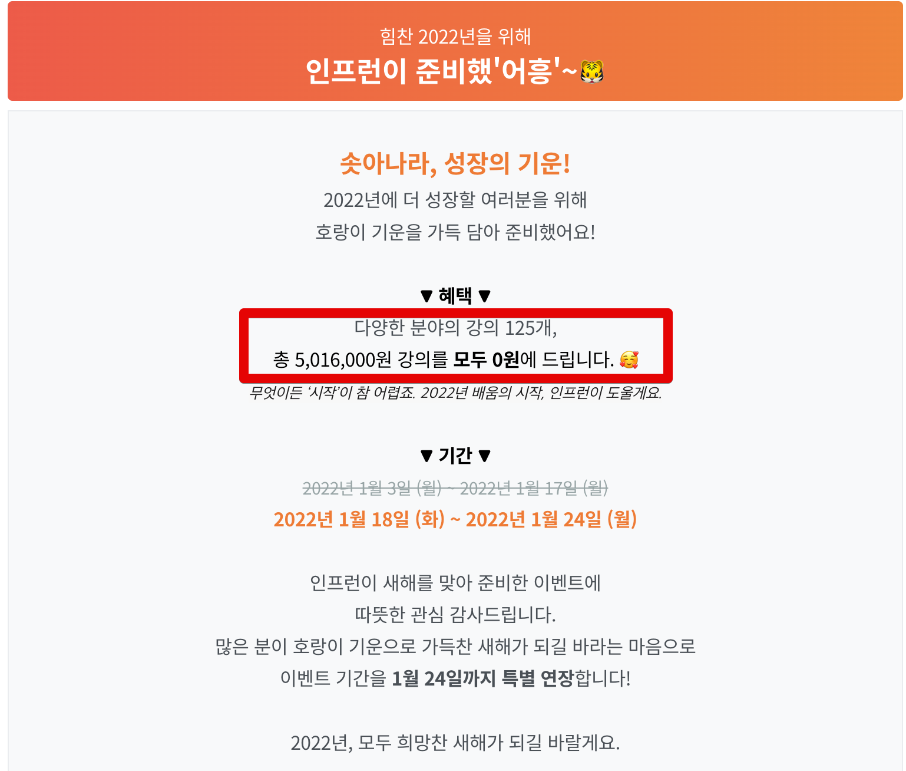
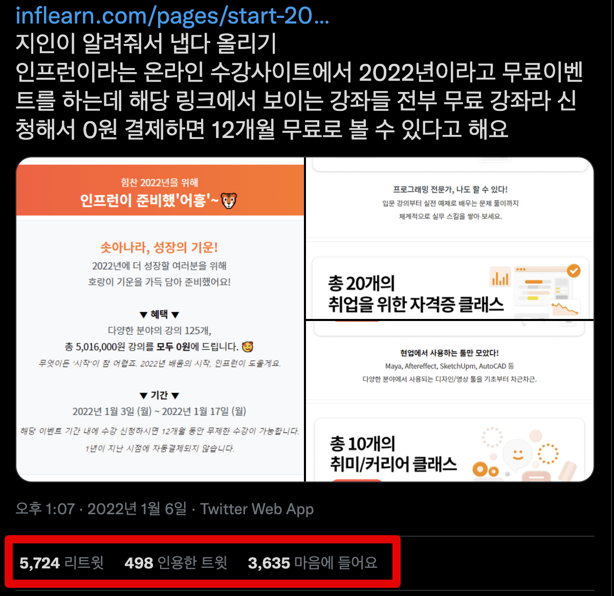
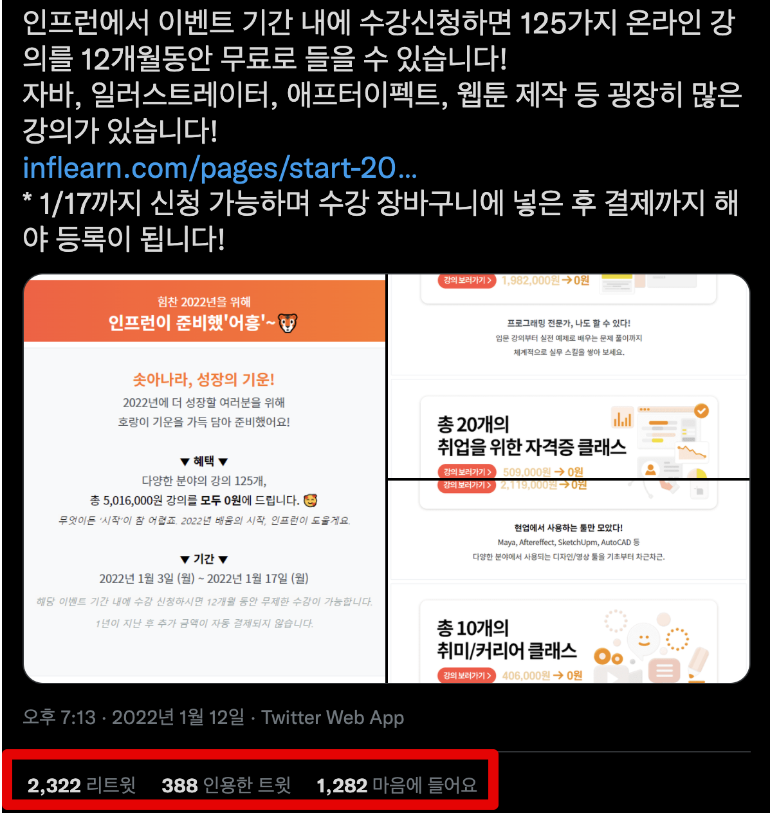
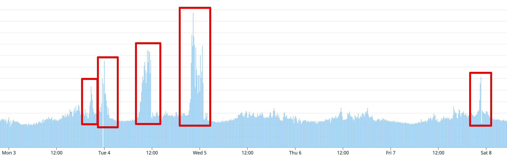
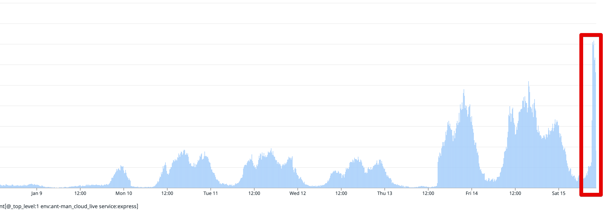
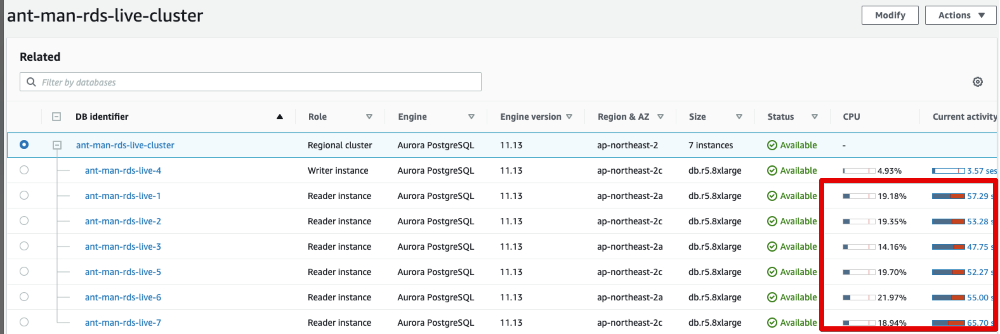
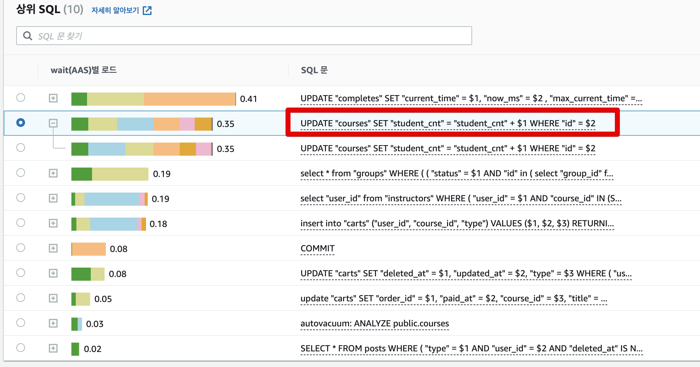
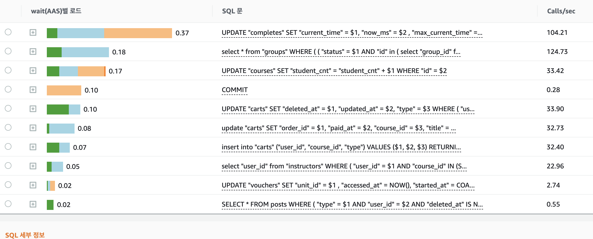

# 2022년 1월 100% 할인 이벤트 장애 회고

안녕하세요 인프런의 향로입니다.  
인프런 서비스는 2022년 1월 3일 ~ 17일까지 지속적으로 서비스를 사용할 수 없는, 역대급 장애가 발생습니다.  

> 다시 한번 서비스 사용에 불편을 드려 정말 죄송합니다.

이 포스팅을 통해 서버문제가 발생한 원인과 이를 해소한 과정을 투명하게 공유드리려고 합니다.    

# 1. 발단

2022년을 맞이해서 인프런에서는 [특정 강의를 100% 할인 이벤트](https://www.inflearn.com/pages/start-20220103)를 진행했습니다.  

다양한 분야의 **강의 125개**,
**총 5,016,000원** 강의를 **모두 0원**에 아래 기간동안 등록할 수 있는 이벤트였습니다.

* 첫번째 이벤트: 2022년 1월 3일 (월) ~ 2022년 1월 17일 (월)
* 두번째 이벤트: 2022년 1월 18일 (화) ~ 2022년 1월 24일 (월)

이 이벤트는 저희의 예상을 벗어날정도로 바이럴이 발생했는데요.

트위터에서만 **1만 리트윗이상**이 발생하고, 그 외 디시인사이드, 루리웹, 클리앙등 여러 IT 커뮤니티에서도 공유가 되어 **평소 대비 5~20배의 트래픽**이 발생했습니다.  
  
아래는 모두 **시간별 트랜잭션수** 인데, 빨간박스가 평소대비 높은 수치를 달성한 시간이고 이때가 모두 장애가 발생하였습니다.

    
이 수치는 그간 저희 서버에서 겪지 못했던 수준의 한게치였고, 앞선 이벤트들에서도 발생하지 않았던 수치였습니다.  
  
그러다보니 가장 피크 트래픽이 발생했던 1월 3일, 4일, 7일, 17일 등 **총 4일 동안 오전 9시, 오후 10시**가 되면 서비스가 불가능했습니다.  
  
이 글을 보시는 분들이라면 의아한 점이 2가지가 있으실것 같습니다.

* 클라우드를 쓰고 있는데 스케일아웃/스케일업을 해도 해결이 안되었던건가?
* 대형 장애가 발생하면 응당 해결을 해야할텐데 왜 며칠씩 발생하도록 둔 것인가?

# 2. 타임라인

아래부터는 

## 1차 장애
관심회사 조회 (a.k.a 메로빈지언) API 슬로우

시간: 2022.01.03 20:30 ~  2022.01.03 22:00 (1시간 30분)

원인: 인덱스를 제대로 타지 못해 발생한 슬로우 쿼리

장애내용

기존에 인덱스가 적용 안되는 관심회사 조회 API가 트래픽이 급증하면서 기존보다 대량으로 발생

해당 슬로우 API들로 인해 Node 서버 전체가 전체적인 지연 현상 발생

(당시 DB의 CPU는 10~30%, 세션은 10개가 안되었던 상황)

 

해결
해당 쿼리에 대한 인덱스 추가 하여 슬로우 쿼리 해소

[Join] 조인 & 추가 조건절 함께 필요한 경우 

추가 이슈

DB 쿼리가 튜닝되었으나, Node 애플리케이션이 요청수를 못버텨 프로세스가 강제 종료

ECS 컨테이너수를 추가 투입으로 해소

2차 장애 
대용량의 데이터 (cache 테이블)의 잦은 IO 이슈

시간: 2022.01.03 23:30 ~  2022.01.04 01:30 (2시간)

원인: Write DB에 대한 부하 & 테이블 데드락

장애내용

엄청나게 큰 cache 데이터의 Insert 와 아직 Reader DB로 전환하지 못한 조회 쿼리들이 합쳐져 CPU 90% 이상까지 올라가서 Write DB 사망

 

이로 인해 전체 서비스가 장애

Write DB 사양 업그레이드 & 재부팅으로 초기화

DB 복구

DB가 복구됨에 따라 다시 트래픽 증가

Node 서버들이 트래픽을 버티지 못해 추가로 30대의 서버를 동시 투입

추가 투입되는 서버들간에 Cache Delete Deadlock 발생

아래와 같이 caches 테이블을 30대가 동시에 동일한 Row를 Delete 요청하여 DeadLock 발생 

RDS DeadLock 지표
이로인해 서비스가 실행을 못하고 대기 상태에 빠지다 바로 종료 되는 현상 발생

아예 서비스가 실행도 못되어서 APM 추적조차 안되었던 상황
 

해결
상세 작업 내용

인프런 배포후 실행되는 cache 테이블 clear 하는 로직 제거

Write DB에서 수행하는 조회 쿼리 제거

업데이트 쿼리에 사용된 뷰 테이블을 제거하고, 집계 방식이 아닌 +1, -1 방식으로 변경

3차 장애
course 테이블 조회 슬로우로 인한 서비스 장애

시간: 2022.01.04 09:00 ~  2022.01.04 12:00 (3시간)

원인: 성능 개선이 되지 못한 수많은 course 조회 쿼리들의 누적으로 인한 서비스 장애

장애내용

해결
불필요한 쿼리 요청들 제거

페이스북으로 보내는 마케팅 스크립트 주석 처리

메인페이지에서 사용중인 courses 관련 탭 제거

로그아웃 유저 

입문강의 리스트

로그인 유저

내가 수강중인 강의의 스킬태그 기반 추천강의 

인덱스를 제대로 타지 못하는 쿼리들 개선

lower("slug") = lower(${slug}) => "slug" = lower(${slug})

내가 구매한 강의 필터 기능 제거

4차 장애
고용량의 select 데이터 조회 (courses 테이블)  및 그로 인한 autovaccum 부하 

시간: 2022.01.04 21:00 ~  2022.01.05 01:40 (4시간 40분)

원인:

 body, text_body 와 같이 강의 상세 정보 (HTML 코드까지 모두 담긴) 가 담긴 고용량의 컬럼을 페이징 쿼리 조회 항목에서 사용

autovaccum 부하가 발생하여 DB 부하 발생

장애내용

리더 DB에서 조회 지연 현상 발생

아래와 같이 페이징으로 수십개씩 조회하는 쿼리에서 (사용하지도 않는) 고용량의 컬럼 (body, text_body) 포함한 형태로 조회

SELECT "courses".*
FROM "courses" AS "courses"
WHERE (("id" IN (SELECT "course_id" FROM "courses_tags" WHERE ("term_id" = $1)) AND
        ("status" = ? AND "published_date" < now() AND "deleted_at" IS NULL) AND "exposure" = $2) AND
       "deleted_at" IS NULL)
ORDER BY "total_seq" DESC, "id" DESC
LIMIT $3 OFFSET $4;
이로 인해 DB 부하 발생

그리고 이를 통해 vaccum 부하가 발생하게 됨

courses 테이블의 vaccum 부하로 인해 DB Load가 계속 올라가게 되어 전체 테이블 조회 지연이 양산됨

해결
courses 테이블의 Autovaccum 종료

ALTER TABLE public.courses SET (autovacuum_enabled = false);

DB 지연 해소 이후 다시 Autovaccum 복구

29cm 장애 해결 사례

select * 로 조회하던 course 쿼리를 아래와 같이 모두 body와 text_body를 제외하고 직접 컬럼 지정하는 방식으로 해소

메인페이지

강의리스트

강의 상세 유사강의 페이지

pages

카트 페이지에서 쿠폰 적용 가능한 강의 조회

태그큐레이션페이지

주의)
4차 장애는 시스템의 문제 보다 우리가 자초한 문제가 3개가 발생해 오히려 더 치명적이다.

코드 수정후 사람이 검증하지 않으면 타입체크도, 기능 검증도 전혀 안되서 배포후 버그가 발생할 확률이 높다

그래서 다시 롤백하고 배포 대기시간동안 대기 했던 것

한번 잘못배포되고 나니 다음 배포까지 또 20분씩 (배포 시간) 장애나는 상황을 지켜만 보고 있어야 했던 상황

슬로우 쿼리가 뭔지 알아도, 어디를 고쳐야하는지 알 수 없는 ORM 코드들

 

1. 아래와 같이 최종 쿼리가 어떤 형태인지 예측할 수 없는 형태로 이루어져있어, 슬로우 쿼리가 뭔지 아는 상황에서도 그게 어느 페이지 혹은 어느 코드에서 쓰이는지를 못찾던 상황

후리 / 꾸기 / 비스타 3명이서 7개 쿼리 수정하는데 3시간이 걸렸다.

해당 쿼리가 어느 페이지 / 어느 코드에서 호출되는지 찾는데만 걸린 것이다.

 

2. 급한 마음에 로컬 환경 테스트 없이 배포했다가 강의 검색 페이지 버그가 있는 상태로 배포

기본적인 기능검증과 타입체크조차 지원되지 않아 배포하기전에 개발자가 테스트하는걸 놓치면 배포하자마자 장애가 발생한다. 

 

5차 장애
장바구니, 구매완료, 결제페이지 슬로우 쿼리

시간: 2022.01.07 21:30 ~  2022.01.03 22:00 (1시간 30분)

원인: where id in () 에 100개 이상의 ID를 넣어서 인덱스 풀스캔이 발생하여 서비스 장애

결제시 주문서 생성 과정에서 장바구니에 담긴 강의 정보를 가져오고 있음

현재 이벤트 진행중인 무료 강의 125개 한번에 담아서 in 절에 해당 강의들이 모두 담긴 쿼리가 실행

 

장애내용

course 관련 조회 쿼리에서 대량의 3초이상 슬로우 쿼리 발생

Reader DB 부하 심화

select * from course 와 관련된 쿼리들 body, text_body 컬럼 제거

슬로우 쿼리 감소

앞서 Reader DB 응답 지연으로 Node JS 애플리케이션 좀비 프로세스

헬스체크시 DB 상태 체크 로직을 제외해서 Node 자체가 죽지는 않음

다만, DB가 복구되어도 Node와 DB간 Connection이 재연결 안됨

NodeJS 서버들 전체 재투입

해결
120건씩 in 에 담기는 것들은 모두 20건씩 나눠 담아서 병렬 쿼리 수행

후속조치
결제페이지(카트리스트 API 포함), 결제완료페이지, 결제내역상세페이지, 대시보드페이지, 내 수강 목록페이지 등에서
다른 데이터(cart/voucher)로 시작하여 id 기반으로 강의를 조회하는 쿼리에 body, text_body 컬럼 제외

장바구니 페이지, 주문서 생성 API, 구매완료 페이지 등에서 조회되는 강의 데이터 컬럼 최적화

수강권 생성시 강의 수강생수 업데이트 로직을 트랜잭션 묶음에서 제외

수강권 생성 후 진도율 동기화 로직 생략

참고

후리 후속 작업 1

후리 후속 작업 2

## 6차 장애 (최종)

현재 (2022.01.15 토요일 오전 09시 ~ ) 이번주 가장 많은 트래픽이 발생하고 있습니다.
(목/금 저녁 10시보다 보다 더)
그럼에도 시스템 모니터링 상에서 이슈되는 영역은 없습니다

그래서 문제가 해결되었구나 라는 생각을 하고 장기 개선 계획만 세우고 있었습니다.  

지금 디스크조각모음이 courses 쪽에서 너무 많이 발생해서 확인해보니
postgresql은 update가 실질적으로 기존 row는 그대로 두고, 새 row를 insert 하는 방식인데,
수강생수 업데이트 때문에 (구) row가 너무 빈번하게 쌓이고 있습니다
(count+1할때마다 기존 row는 디스크조각모음때 삭제하기 위해 남겨놓고, 새 row 넣는 방식)
그래서 계속 디스크조각모음이 발생하고,
그게 한계치에 이르면 지금처럼 모든 쿼리가 슬로우가 되는데요