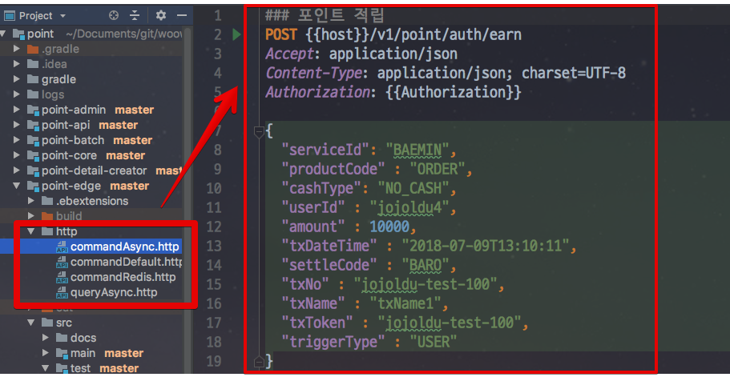

# 포인트 시스템 개편기 #1 - 개발

올해 4월 중순부터 시작해 7월 말까지 진행된 포인트 시스템을 개편했던 경험을 공유하려고 합니다.  

기존에는 포인트라는 서비스 자체가 구축되어 있지 않았습니다.  
**중앙 DB에 존재하는 포인트 테이블과 프로시저만 존재**했습니다.  
그러다보니 모든 서비스가 **필요하면 포인트 프로시저를 수행하고 개별적으로 사용**하는 구조였습니다.  
  
기존에 구성된 도메인 모델과 프로시저 등에 계속해서 문제가 발생하고 있었고, 시스템 확장성도 굉장히 떨어졌기 때문에  개편은 피할 수 없었습니다.  
  
신규 시스템을 오픈한다는 것은 **서버, 배포 환경, 도메인 모델, 어플리케이션 등을 완전히 제로에서 새로 만들어야 함**을 의미했습니다.  
그 과정에서 저희가 했던 고민들을 공유하면 비슷한 상황에 있으신 분들에게 조금이나마 도움이 되지 않을까 싶어 작성했습니다.  
  
내용은 크게 2파트로 나눴습니다.

1. 개발 단계
2. 오픈 준비 단계

## 1. 기술 스택

신규 포인트 시스템의 기술 스택은 다음과 같습니다.

* Java 8
* Querydsl 4.x
* Junit 4 & Spock
* Spring Boot 2.x
* Spring Cloud 2.x
* AWS Beanstalk
* AWS Aurora RDS
* AWS Elastic Cache - Redis
* AWS SQS
* Jenkins

어플리케이션쪽은 기존 Java & Spring 개발자분들이 쓰시는 기술 스택과 크게 차이가 안날것 같습니다.  
이외 나머지 기술들을 선택했던 이유들을 하나씩 소개하겠습니다.

### 1-1. Beanstalk vs EC2 & ASG (Auto Scaling Group)

처음 구축 할때는 AWS Beanstalk을 선택했습니다.

* 이미 회사에는 Beanstalk을 다양하게 쓰면서 쌓인 노하우가 있었습니다.
* ebextension으로 인해 빠르게 Nginx, 리눅스 커널들을 설정하고 서버 환경 구축이 가능했습니다.

이 2가지 이유로 Beanstalk을 선택 하고 **실제 오픈까지 진행**했습니다.  
  
하지만 오픈하고 난 뒤부터 Beanstalk의 단점이 하나씩 보이기 시작했습니다.  
(사실 그전에도 보였습니다만 애써 모른척했습니다.)  

* 한번 잘못 생성한 Beanstalk 환경을 수정하기가 어렵습니다.
    * 특히 잘못 생성한 Beanstalk 환경을 삭제하려면 1시간이 필요해 같은 이름의 Beanstalk으로 다시 생성하는데 대기 시간이 너무 길었습니다.
* 상세한 설정이 어렵습니다.
    * 예를 들어 Beanstalk 배포가 성공하면 알람을 주도록 설정하고 싶은데 Beanstalk 웹 콘솔에는 그런 설정이 없어 AWS CLI를 쓰거나 젠킨스 플러그인을 통해서만 가능했습니다.
* **배포 시간이 너무 길었습니다 (1대당 5분)**
* 같은 Beanstalk 환경에서 **특정 서버만 다르게 설정하는 것이 정말 불편**합니다.

특히 마지막 2개 단점이 치명적이였습니다.  
  
AWS Beanstalk의 경우 한대 서버에 배포하는 시간이 5분이 필요합니다.  
**5대에 배포해야 할 경우 한대씩 5분이 걸리니 총 25분이 필요**했습니다.  
서버 교체가 아닌 단순히 Application만 배포하는데도 한 대당 5분씩 걸리는 것은 문제가 있다고 생각했습니다.  
  
배포 대수를 30% 혹은 50%로 선택하기엔 무리가 있었습니다.  
배포하는 순간에 남은 서버들에 크게 부하가 증가하기 때문입니다.  
  
그래서 이 문제를 회피하기 위해 **같은 설정의 Beanstalk를 하나더 생성해 반대편 환경에 100%로 배포하고 ELB를 스위칭 하는 방법** 등을 고려했습니다.  
하지만 **배포하는게 이렇게 번거로워야하나?** 라는 아주 근본적인 생각이 들었습니다.  
  
또한 특정 서버만 다른 환경 설정이 어렵다는 것도 큰 문제였습니다.  
저희는 모니터링툴로 **Newrelic**과 **핀포인트**를 함께 쓰고 있습니다.  
두 솔루션에는 문제점이 하나 있었는데요.  
**Newrelic APM (인프라스트럭쳐 X) 와 핀포인트를 같이 사용할 수 없습니다**.  
  
IDC를 사용할때는 큰 문제가 없었습니다.  
1번 서버는 Newrelic APM을, 나머지 서버들에는 핀포인트를 설치해서 쓰면 됐기 때문입니다.  
하지만 Beanstalk은 **같은 환경 내의 특정 서버만 다른 설정을 갖도록 하는 것이 정말 어렵습니다**.  
불가능한 것은 아니지만, 사실상 쉘스크립트로 다 짜야하는 상황이였습니다.  
  
이런 문제점들로 인해 시스템 오픈 하고 난 뒤, 팀의 개발자분이 직접 Code Deploy 전환을 진행하셨습니다.  
현재 모든 포인트 시스템은 AWS Beanstalk을 제거하고 **ASG (Auto Scaling Group) & Code Deploy**로 완전히 전환되었습니다.  
그리고 위에서 언급한 단점들이 모두 해결되어 큰 문제없이 사용중입니다. 

### 1-2. Spring SQS Listener vs Beanstalk Worker

Spring과 Beanstalk을 쓰고 있는 상황에서 AWS SQS에서 메세지를 수신할 수 있는 방법은 크게 2가지가 있습니다.

* Spring Cloud AWS 에서 제공하는 ```@SqsListener```
* AWS Beanstalk에서 제공하는 Worker (한글명으로는 작업자 환경입니다.)

Beanstalk Worker에 대해 간단하게 소개드리면 **Beanstalk 내부에 SQS 메세지 리스너 데몬을 두고 해당 데모이 어플리케이션으로 SQS 메세지를 담아 HTTP API 요청**을 보내는 환경을 얘기합니다.


(좀 더 자세한 내용은 AWS의 [공식 문서](https://docs.aws.amazon.com/ko_kr/elasticbeanstalk/latest/dg/using-features-managing-env-tiers.html)를 참고하시면 더욱 좋습니다.)  
  
AWS Beanstalk에서 제공하는 Worker 서비스를 사용하면 몇가지 장점이 있습니다.

* 모니터링이 쉽습니다.
    * 어플리케이션에서는 API형태로 Controller을 만들면 Beanstalk에서 SQS 메세지를 수신해 해당 API로 HTTP Request를 보냅니다.
    * 어플리케이션 입장에서는 일반적인 HTTP Request와 같기 때문에 모니터링이나 추적이 쉽습니다.
    * 즉, 비동기 요청에 대한 기능 지원이 안되는 모니터링 툴도 사용할 수 있습니다.
* 구축이 쉽습니다.
    * 기존에 HTTP API를 만들던 방법으로 그대로 어플리케이션을 구현하면 되니 메세징에 대해 신경쓰지 않고 구축할 수 있습니다.

하지만 저희는 Spring Cloud AWS 에서 제공하는 ```@SqsListener```를 선택했습니다.  

* **특정 벤더 (AWS)에 Lockin 되는 것은 좋지 않다**고 생각했습니다.
    * 언제든 IDC로 혹은 다른 클라우드로 이동할 수 있게 구성되어야 한다고 생각했습니다.
* Beanstalk Worker 내부의 메세지 수신 데몬의 오류가 있을 경우 저희쪽에서 대응할 방법이 없습니다.

실제로 이렇게 구축한 덕분에 시스템 안전화 이후 **ASG & Code Deploy로 시스템 환경을 변경할때 큰 번거로움없이 진행**될 수 있었습니다.  
만약 Beanstalk Worker를 사용했다면 Worker에서 해주는 부분을 어플리케이션에서 다시 구현해야 하고, 이 부분에 대한 성능 테스트와 QA를 또 했어야 했기 때문에 시도하지 못했을 것입니다.

### 1-3. Jenkins vs AWS Code Pipeline

개인 프로젝트에서는 AWS Code Pipeline을 사용하고 있습니다.

* [AWS로 배포하기](https://jojoldu.tistory.com/281)

아무래도 Code Build & Code Deploy & Code Pipeline으로 구축할 경우 **빌드 & 배포 시간에만 비용이 청구**되기 때문에 비용도 절약할 수 있고, 별도로 CI 시스템 구축할 필요도 없어서 선호했습니다.  

하지만 이번 포인트 시스템에서는 Jenkins + Beanstalk (현재는 Jenkins + Code Deploy로 전환)를 선택했습니다.  
  
그 이유는 다음과 같은데요.

* AWS Code Pipeline으로 [멀티 모듈 프로젝트](https://jojoldu.tistory.com/123) 를 구성하는게 쉽지 않았습니다.
* Jenkins 에 이미 익숙한 상태라 커스텀하게 배포 환경 구성이 필요해도 쉽게 구성할 수 있는 반면, AWS Code Pipeline은 자료가 생각보다 없어서 생각보다 삽질하는 시간이 필요했습니다.
* 저희 팀의 다른 서비스인 빌링과 정산은 IDC를 써야만 합니다. 그래서 젠킨스를 쓸 수밖에 없는데, 포인트 시스템만 AWS Code Pipeline 으로 사용하기엔 팀 컨벤션에 맞지 않다고 생각했습니다

마지막 이유가 가장 중요했습니다.  
결과적으로 팀의 모두가 CI/CD 환경을 다룰 수 있어야하는데, **Jenkins 외에 다른 시스템을 도입할 경우 팀에 부담을 주는 일이 될 수 있기 때문**입니다.  
  
아마 팀 CI툴이 Teamcity였다면 마찬가지로 Teamcity를 선택했을 것입니다.  
어찌 됐든 이런 인프라 환경은 팀 컨벤션을 맞추는게 중요하다 생각해 기존과 최대한 유사한 환경을 선택했습니다.

## 2. 도메인

신규 포인트 시스템은 **Update와 Delete가 없는 도메인**으로 구성하였습니다.  
포인트는 일종의 기업 부채 혹은 재화와 비슷한 의미로 사용되기 때문에 그 **이력은 아주 정확하고 상세하게 관리**되어야만 했습니다.  

기존 시스템의 경우 Update가 있었기 때문에 **왜 이 회원의 포인트가 이 금액이 되었는지 정확히 추적하기가 어려웠습니다**  
현재 가용포인트와 실제로 적립/사용된 포인트의 계산이 안맞는 경우도 있었으며, 이럴 경우 틀어진 데이터를 수정해야하는데, 한번 틀어진 데이터를 다시 맞추기가 너무 어려웠습니다.  
  
그래서 모든 포인트 데이터는 **Insert만 존재하는 도메인 모델**로 구현하였습니다.  
이 모델로 구현하면서 기본적인 기능인 적립이나 조회에 대해서는 크게 어려움이 없었습니다.  
하지만 몇몇 경우에선 문제가 되었습니다.

### 2-1. 포인트 사용 & 차감

예를 들어 1000원의 포인트를 유저가 사용했다면 단순하게 생각하면 -1000원이란 포인트 데이터를 한줄 추가하면 된다고 할 수 있습니다.  
하지만 그럴수가 없었습니다.  
바로 **유효기간만료** 때문입니다.  
예를 들어 50원이 적립되었고, 이 50원 중 40원이 쓰여졌다면, **10원이 남아있으니 유효 기간이 지나면 10원만 만료처리**가 되어야만 합니다.  
단순한 Insert 모델에서는 이런 처리에 대해서 처리하기가 어려워 **상세 도메인**을 추가하였습니다.


그리고 포인트 차감에 관련된 이벤트는 다음과 같은 룰을 정했습니다.

1. 사용/차감/만료 등 **포인트 차감 이벤트의 경우 포인트 상세 테이블을 통해 계산**된다.
2. 사용/차감/만료 등 포인트 차감 이벤트의 경우 포인트 상세 테이블에서 **적립 ID로 Group by 한 기준으로 처리**된다.

예를 들어 다음과 같은 케이스라고 보시면 됩니다.


* 10원 적립 (a1)
* 30원 적립 (a2)
* 20원 적립 (a3)
* -50원 사용 (a4)

위처럼 메인 이벤트가 발생하면 적립된 순서대로 다음과 같이 상세 테이블에 이벤트가 쌓이게 됩니다.

* -10원 사용 (a1 적립을 차감)
* -30원 사용 (a2 적립을 차감)
* -10원 사용 (a3 적립을 차감)

이렇게 되면 a1과 a2는 Group By 하게 되면 **0원이 되어 이후의 계산 로직에서는 모두 제외** 됩니다.  

유효기간만료 이벤트 처리도 아주 쉽게 해결됩니다.  
**적립 ID를 기준으로 Group by 해서 0원이 아닌 금액은 모두 만료** 처리를 하면 됩니다.  


앞서 사용 이벤트로 10원이 남은 사용자의 남은 포인트는 10원입니다. (a3의 남은 적립 포인트 금액)  
이 10원의 유효기간이 지나면 10원에 해당하는 금액만큼만 만료 시키면 됩니다.  
  
아무래도 포인트의 경우 다양한 케이스가 있습니다만, Insert & 상세 이벤트 모델로 모든 경우를 대응할 수 있게 되었습니다.  
특히 이 도메인 모델로 인해 **누락된 이벤트 처리가 아주 쉽게 처리 됩니다**  
누락되었으면 해당 이벤트를 한줄 추가만 하면 되기 때문입니다.  

## 3. 시스템 아키텍처

이번 포인트 시스템의 아키텍처 기조는 **DB가 죽어도 문제 없는 서비스**였습니다.  
이를 위해서 AWS SQS를 적극적으로 사용했습니다.  
  
이 구조로 가져가면서 얻은 장점은 다음과 같습니다.

* RDS가 죽어도 SQS에는 이벤트 메세지들이 쌓여 있기 때문에 RDS가 복구되는 순간 처리 가능
* 가장 많이 사용되는 포인트 조회는 Redis 캐시를 통해 처리되니 RDS가 죽어도 시스템 문제가 없음
* Redis가 죽는 장애가 발생하면 바로 RDS를 통해 조회가 되도록 구성

특히 포인트 시스템을 가장 중요하게 사용하는 **주문 시스템과 결제 시스템도 마찬가지로 SQS로 비동기 시스템이 구축**되어 있습니다.  
  
그래서 포인트의 모든 서비스가 죽는다 하더라도, **주문 시스템과 결제 시스템은 자체 SQS에 메세지를 계속 담아두고 포인트 시스템이 다시 실행되면 그때 메세지를 일괄 발송**하면 되므로 고가용성 시스템을 구축할 수 있었습니다.  
  
포인트 시스템의 전체 아키텍처를 간단하게 그려보면 다음과 같습니다.  


기본적인 이벤트 구조는 다음과 같습니다.


* Service API인 point-edge 모듈에 적립/적립취소 이벤트 요청이 온다
* point-edge 모듈는 **해당 이벤트를 Command Queue에 발송**한다.
* Command Worker에서 해당 이벤트 수신 후 **RDS에 반영**한다.
* Command Worker에서 반영된 이벤트를 **가용포인트 갱신 Queue에 이벤트 발송** 한다.
* 가용포인트 갱신 Worker는 가용포인트 갱신 Queue에서 이벤트를 수신 후, **Redis에 해당 사용자의 가용 포인트를 계산하여 반영**한다.

여기서 한가지 다른 점은 **포인트 사용 이벤트는 SQS를 쓰지 않고 바로 데이터베이스에 반영한다**는 점입니다.  
만약 포인트가 사용되는 이벤트가 즉시 처리 되지 않으면, **사용자는 서버가 메세지를 수신 받기전에 다시 같은 포인트를 사용할 수 있습니다**.  
이를 막기 위해 포인트 사용 이벤트는 즉시 처리되도록 구현하였습니다.


DB에 즉시 반영 후, 포인트 변경이 있었기 때문에 가용포인트 갱신을 위한 SQS 메세지만 보내면 됩니다.  
다만, 사용 취소의 경우 즉시 처리할 필요가 없기 때문에 기본 방식 그대로 SQS 기반으로 처리하도록 구성했습니다.  
  
스프링 배치를 통한 이벤트 처리 역시 point-edge 모듈을 통해서 처리되도록 했습니다.  


API, Admin 뿐만 아니라 Batch에서도 point-edge 모듈을 보게 함으로써 **포인트의 모든 End Point가 point-edge에 집중**되어, SQS 기반의 이벤트 아키텍처가 완성되었습니다.

### 3-1. 주의할 점

SQS 기반의 아키텍처 구성에 있어 가장 주의해야할 점은 **SQS는 순서가 보장되지 않는다**는 점입니다.  
그래서 주문 한 뒤, 바로 취소를 할 경우 상황에 따라 **취소가 먼저 오고, 적립이 다음에 올 수 있습니다**.  
이럴 경우 적립된 대상이 아직 없기 때문에 취소 이벤트는 실패하게 됩니다.  
  
이걸 해결하기 위해 취소할 대상이 없는 경우 처리하지 않도록 구성하였습니다.  
(다시 SQS로 돌려보낸다라는 의미입니다)  
대신 5번 실패하게 되면 Dead Letter Queue 로 보내어 이만큼 실패했다면 진짜 잘못된 메세지로 보도록 구성하였습니다.


## 4. 테스트

전혀 테스트 코드가 없었던 레거시 프로시저와 완전히 새롭게 변경된 도메인, 이 2가지는 개편에 있어 막연한 두려움을 주었습니다.  
예상치 못했던 문제가 어디서 나올지 알 수 없었기 때문에 테스트 코드를 굉장히 빡빡하게 작성하였습니다.

### 4-1. 단위 테스트와 통합 테스트

단위 테스트 & 통합 테스트 도구로는 **Junit4**와 **Spock**을 같이 사용했습니다.  
팀에서 테스트 도구를 Spock으로 점차 넘어가는 중이지만, 아직 Junit4가 익숙하신 분이 계셔 Junit4를 사용해도 무방하다는 룰을 정했습니다.  
**Spock을 연습하면서 프로젝트를 진행하기에는 시간이 그렇게 넉넉하지 않았기 때문**입니다.  
  
단위 테스트와 통합 테스트를 모두 필수로 작성하면서 프로젝트를 진행했습니다.  
단위 테스트는 필수, 통합 테스트는 선택으로 해도 좋지 않을까 싶었습니다.  
  
아직 테스트 코드와 코드 디자인에 대해서 높은 수준이 아니다보니 **단위 테스트가 통과해도 통합 테스트에서 실패하는 경우**가 종종 있었습니다.  
특히 단위 테스트 작성을 위해 **과한 Mocking**과 **잘못된 단위 설정**등이 몇번 발생하다보니 **통합 테스트도 필수로 짜서 실제 전체 프로세스를 수행해도 문제가 없는 것을 확인하는 것**까지로 결정했습니다.  
  
조금 부담스럽긴 했지만, QA기간에 **기본적인 기능 조차 제대로 통과 못하는 것보다는 훨씬 낫다**는 생각에 결정했고 짧은 QA 일정으로 프로젝트를 끝낼 수 있었습니다.

### 4-2. Spring Cloud & AWS 테스트

신규 포인트 프로젝트의 큰 기조 중 하나는 "**Git Clone 받으면 바로 로컬 개발 환경 & 테스트가 실행될 수 있어야 한다**" 입니다.  
**프로젝트 받은 뒤에 A도 해야하고, B도 해야하고, C도 해야만 로컬에서 실행할 수 있는 환경은 절대 하지 않기**로 했습니다.  
  
하지만 이런 환경을 구축하는데 큰 걸림돌이 Spring Cloud AWS 코드의 테스트 환경 구축입니다.  
AWS RDS와 Elastic Cache에 대한 통합 테스트를 작성하는데는 큰 문제가 없었습니다.  
Embedded 솔루션들이 존재했기 때문입니다.

* RDS : [H2](http://www.h2database.com/html/main.html)
* Elastic Cache : [Embedded Redis](https://github.com/ozimov/embedded-redis)
  
하지만 **SQS에 대한 Embedded 솔루션이 없었습니다**.  
  
이 문제를 해결하기 위해서 공용 계정을 쓰면 안됩니다.  
실제로 우아한 형제들에서는 자유롭게 AWS를 사용하고 테스트 할 수 있게 **놀이터**라는 샌드 박스 계정이 존재합니다.  
보통 로컬 환경에서 AWS를 테스트할때는 이 놀이터 계정을 맘껏 사용하는데요.  
포인트 시스템 개편에서 SQS를 놀이터 계정을 이용하는건 문제가 있었습니다.


개발자 A가 로컬에서 발송한 SQS 메세지가 개발자 B의 로컬에서 혹은 Jenkins등 다른 곳에서 메세지를 수신해버려 개발자 A에서는 제대로 기능을 테스트 해볼수가 없습니다.  
즉, 모두가 접근할 수 있는 **공용 저장소를 사용하는 순간 서로가 서로의 테스트를 침범**하게 되어 격리된 테스트 환경 구축을 못하게 되버렸습니다.  
  
이건 굉장히 큰 문제라 생각했습니다.  
그래서 어떻게 하면 H2, Embedded Redis와 같이 **격리된 SQS를 구축할 수 있을까 고민 하던 중, [ElasticMQ](https://github.com/adamw/elasticmq)를 발견**했습니다.  
  
Scala, Akka 기반의 Elastic MQ를 팀에서 좀 더 쉽게 사용하기 위해 [Spring Boot용 랩핑 라이브러리](https://github.com/jojoldu/spring-boot-aws-mock)를 만들어 사용하였습니다.

이제는 **의존성만 추가하면 H2 사용하듯이 SQS를 사용**할 수 있게 되었습니다.  


(Redis로 포인트 갱신 이벤트가 제대로 발생하는지 검증하는 테스코드)  
  
해당 라이브러리 사용후 다음과 같은 검증 문제가 모두 해결되었습니다.

* 내가 만든 SQS Listner가 제대로 메세지를 수신하는지
* 내가 만든 QueueTemplate이 메세지를 제대로 송신하는지
* 내가 지정한 횟수만큼 실패시 Dead Letter Queue에 전달하는지
* 메세지가 원하는대로 JSON 전환되어 전달되는지

특히 통합 테스트의 경우 정말로 SQS 메세지 발송 혹은 수신까지가 모두 테스트 코드로만 검증할 수 있게 되어 더욱 튼튼한 테스트 구조를 만들 수 있었습니다.

### 4-3. 레거시 프로시저 테스트

신규 도메인은 모두 JPA를 사용하고, 모든 로직은 어플리케이션에 있었기 때문에 H2를 사용해도 문제가 없었습니다.  

> 즉, Database에서 로직을 처리하는 password(), now(), 스토어드 프로시저 등을 전혀 사용하지 않습니다.

하지만 기존 레거시 시스템의 프로시저를 검증하기 위한 테스트 코드를 작성하는데 문제가 있었습니다.  
**H2는 MSSQL의 프로시저를 지원하지 않기 때문**입니다.  
  
이 문제를 어떻게 해결할까 고민하다가 이 **레거시 프로시저와 관련된 코드들을 테스트 할때만 Docker**를 사용하기로 결정했습니다.  
  
그래서 레거시 프로시저용 API를 담당하시는 개발자분의 **개인 PC와 지속적인 테스틀를 진행할 젠킨스 서버에 Docker로 MSSQL을 설치하고 기존 시스템의 프로시저를 모두 생성**했습니다.  

그리고 이렇게 작성한 테스트 코드와 Docker는 시스템이 더이상 이전 프로시저를 지원하지 않아도 되는 순간 일괄 삭제하여 깨끗한 프로젝트로 구성을 하였습니다.


### 4-4. HTTP API 테스트

일반적으로 **개발 서버에 배포된 서비스의 HTTP API 테스트**는 Postman을 사용합니다.  
(배포 전의 테스트는 당연히 단위 테스트 or 통합테스트 코드로 진행합니다.)  
  
저희는 팀 모두가 IntelliJ Ultimate 버전을 사용하고 있었기에 IntelliJ의 ```.http```를 사용하기로 결정했습니다.  
그 이유는 아래와 같습니다.

* HTTP API 테스트에 대한 버전 관리 가능
* HTTP API 스펙을 팀원 모두가 공유 가능
* 코드 자동 완성
* IntelliJ의 단축키
* 코드 하이라이팅
* Environment 관리

특히 **HTTP API 테스트를 코드로 남긴다**는 점이 중요합니다.  
버전 관리, 이력 추적등등 팀 단위의 개발에서 정말 많은 장점을 주기 때문에 Postman을 선택할 이유가 하나도 없었습니다.  



(포인트 시스템의 ```.http``` 코드)  
  
IntelliJ의 ```.http```에 대한 상세한 설명은 이전에 작성한 글이 있으니 참고하셔도 좋을것 같습니다.

* [IntelliJ의 .http를 사용해 Postman 대체하기](https://jojoldu.tistory.com/266)

## 5. API 문서 자동화

주문, 빌링, 정산, 회원, 쿠폰, 메인 프론트 등 여러 팀에서 포인트의 API를 사용해야 했기 때문에 API문서는 필수였습니다.  
**수동으로 작성하는 것은 언젠간 코드와 문서간에 간격이 발생**해서 문서 자동화에 대해 고민했었습니다.  
API 문서 자동화에 관한 솔루션들은 많습니다.

* Swagger
* Apidoc
* Spring Rest Docs

이 중에서 저희는 [Spring Rest Docs](https://spring.io/projects/spring-restdocs)를 선택했습니다.  
나머지 문서 자동화 솔루션들에는 개인적으로 생각하는 큰 단점들이 있었습니다.  

Apidoc의 경우 2가지 단점이 있었습니다.

* 문서를 사실상 수동으로 작성하는 것과 마찬가지라 문서와 코드가 따로 작동합니다 
* Apidoc을 위한 어노테이션이 프로덕션 코드를 오염시켰습니다

Swagger의 경우도 비슷한 단점이 존재했습니다.

* API를 테스트하기는 좋으나 Swagger 문서를 보고 연동 시스템을 만들기에는 부족한게 많습니다
* 프로덕션 코드가 Swagger 어노테이션으로 오염됩니다

반대로 Spring Rest Docs의 장점은 다음과 같습니다.

* **테스트 코드를 작성하면 문서로 자동 완성**
    * 테스트 코드를 기준으로 문서가 만들어 지기에 프로덕션 코드에 관련된 코드가 전혀 필요 없음
    * 테스트 코드 기반이라 문서와 코드가 불일치하는 경우가 발생할수가 없음
* 테스트 코드로 표현하기 어려운 부분은 AsciiDoc 혹은 Markdown으로 작성 가능
* 익숙한 문서 형태
    * Spring 공식 Document와 동일한 스타일입니다.

Spring Rest Docs는 그간 제가 문서 자동화 솔루션들에 갖고 있던 불만을 모두 해결해주었습니다.  
즉, 테스트가 깨지면 문서가 만들어지지 않기 때문에 **잘못된 API 문서가 발행될 일이 사전에 차단**됩니다.  
특히, 저희 팀은 테스트 코드 작성이 팀 규칙상 필수였기 때문에 테스트 코드 기반의 문서 자동화 솔루션인 Spring Rest Docs는 아주 좋은 선택지였습니다.  


(Rest Docs로 만든 포인트의 API 문서)  
  
다만 단점도 있었는데요.

* 테스트 코드로 문서를 표현해야하기에 Rest Docs용 테스트 코드의 양이 비정상적으로 많습니다.
    * **RequestDto와 ResponseDto의 필드 명세를 모두 작성**해야만 했습니다.


**선언되지 않은 필드는 오류로 보고** 바로 테스트가 깨져버리기 때문에 모든 필드를 테스트 코드에서 선언해야만 했습니다.  


Spring Rest Docs를 사용하는 방법은 크게 2가지가 있습니다.  
AsciiDoc과 Markdown입니다.  
처음 Rest Docs를 고려했을때는 Markdown 타입을 사용하려고 했습니다.  
팀 전체가 AsciiDoc 보다는 Markdown에 더 친숙하기 때문이였습니다.  
  
하지만 Markdown 버전의 Spring Rest Docs를 한번 사용해 보고는 바로 포기했습니다.

* Ruby 라이브러리인 slate에 의존해야만 하는 구조
    * 팀 구성원 전체가 Ruby & Gem을 설치하고 bundler까지 설치해야하는게 너무 번잡합니다.
* 만들어지는 문서가 기존 스프링 관련 문서들에 비해 UI가 친숙하지 않습니다.
* 빌드 시간이 너무 오래 걸립니다.
    * Ruby 의존성들이 많아 빌드시간이 전체적으로 너무 오래걸립니다.

그래서 **AsciiDoc 버전으로 결정**했습니다.  
현재는 포인트 시스템의 문서 자동화가 굉장히 잘 되어서 다른 서비스인 빌링, 정산 역시 문서를 Spring Rest Docs로 전환 중입니다.  
  
Spring Rest Docs 사용 방법은 블로그에 정리했으니 참고하시면 좋을것 같습니다.

* [Spring Rest Docs를 Markdown으로 작성하기](https://jojoldu.tistory.com/289)
* [Spring Rest Docs를 AsciiDoc으로 작성하기](https://jojoldu.tistory.com/294)

## 6. 브랜치 전략

저희 팀은 Git Branch 전략을 사용하고 있었습니다.  
하지만 포인트 시스템을 구축하는 과정에서는 이 전략을 사용하지 않았습니다.  

* 일정이 넉넉치 않았습니다.
    * 기존 도메인 분석 기간과 성능 테스트 & QA를 제외하면 실제 개발 가능한 시간이 2달채 되지 않았습니다.
* 시스템 구축에 투입된 개발자가 3명 이였으며, 3명이 완전히 독립적인 모듈을 담당했기 때문에 코드가 겹칠일이 거의 없었습니다.

특히 각자 진행해야할 모듈을 명확히 분리해서 구현하고 있었고, 테스트 대상도 분리되어 있어 굳리 Branch로 분리 할 필요가 없던 상태였습니다.  


(프로젝트 모듈 구성)  
  
그러다보니 브랜치 전략이 굳이 필요할까에 대해서 고민하게 되었습니다.  
고민의 결과 저희는 단일 브랜치 전략을 선택했습니다.  
즉, **master 브랜치만 유지하고 모든 커밋을 master**에만 하였습니다.  
(물론 현재는 Git Branch 전략을 사용중입니다.)  

해당 전략으로 진행하면서 특별히 문제가 느껴진게 없었습니다.  
꼭 알려진 Branch 전략들을 선택하지 않고, 상황에 따라 유동적으로 정해도 되겠다는 것을 깨닫게 되었습니다.

## 1장 마무리


