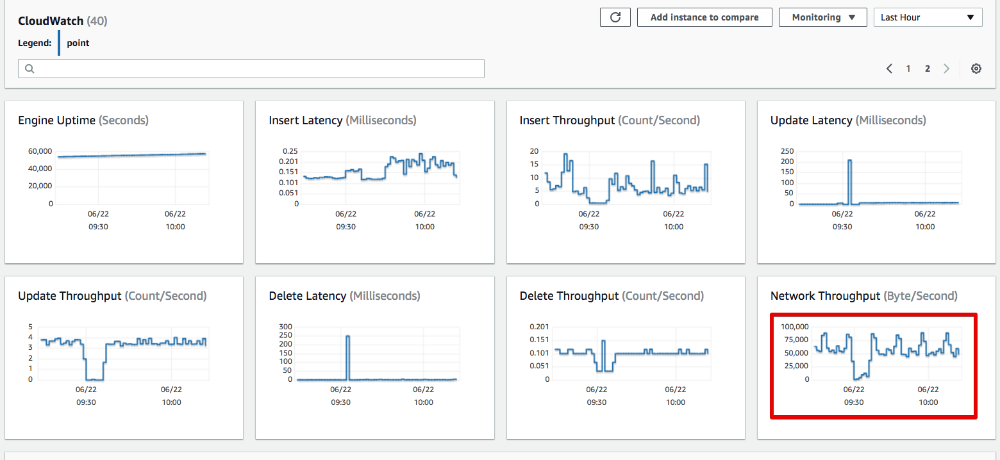
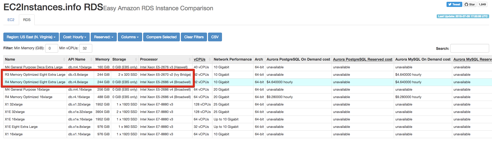
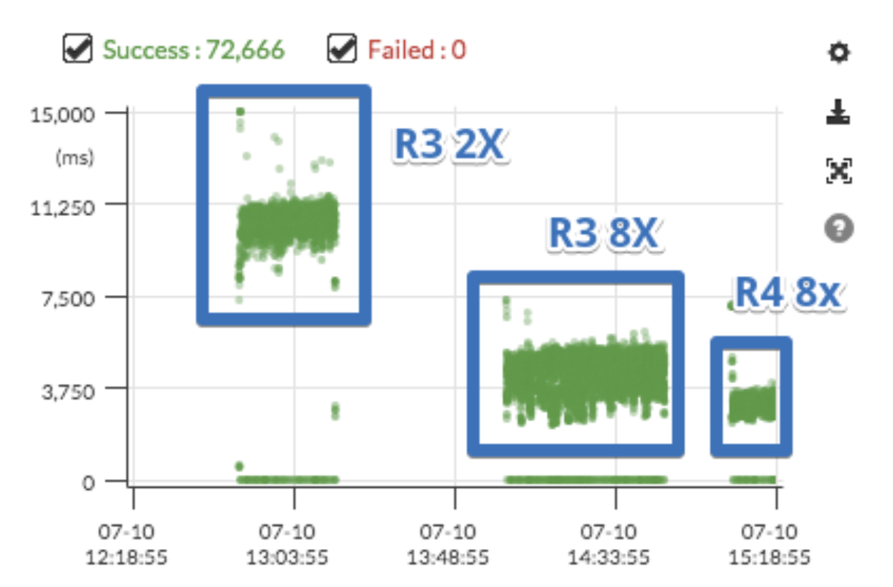

# # 포인트 시스템 개편기 #2 - 오픈 준비

개발을 시작할때부터 어떻게 오픈할 것인지에 대해 계속 고민하고 있었습니다.  

## 7. 성능 테스트

성능 테스트의 경우 네이버에서 만든 [Ngrinder](http://naver.github.io/ngrinder/)와 [Pinpoint](https://d2.naver.com/helloworld/1194202)를 사용했습니다.  
  
여러 좋은 툴이 있지만, 이 2개를 선택한 이유는 **익숙해서**입니다.  
Pinpoint는 이미 팀내에서 공식 모니터링툴로 계속해서 사용해오던 상태였으며, Ngrinder는 Spock, Gradle 등으로 Groovy 문법이 크게 어렵지 않은 상태에서 좋은 선택지였습니다.  

> 이미 개인 프로젝트로 이 둘을 계속해서 사용해오던 상태였어서 다른 선택지를 굳이 찾을 필요가 없었습니다.

성능 테스트는 두번 진행했습니다.

1. 레거시 프로시저를 랩핑한 API의 성능 테스트
2. 신규 도메인 모델 API의 성능 테스트
  
같은 기능을 가진 API가 무조건 2개씩 만들어져야만 했습니다.  
이렇게 구성한 이유는 다음과 같습니다.

* **롤백의 위험 부담 최소화**

기존에 포인트를 쓰던 다른 팀과 서비스에서
레거시 프로시저를 랩핑한 API가 선 오픈되고, **이 API가 문제만 없다면 이후 신규 도메인과 API에 문제가 있어도 언제든 롤백**할 수 있기 때문입니다.  
  

  
특히 1번 테스트가 중요했습니다.  
기존에는 **각 서비스가 별도로 프로시저를 수행했기 때문에 서비스 별로 부하를** 나눠 가졌습니다.  
하지만 이제 신규 구축하는 포인트 시스템에서 프로시저에 대한 모든 요청을 처리해야했기 때문에 부하 예측이 어려웠습니다.  
  
그래서 **주말 피크타임의 주문수 * 5배**의 TPS를 성능 테스트의 기준으로 정했습니다.  


신규 포인트 시스템은 **쌓여 있던 포인트 데이터를 모두 신규 도메인으로 마이그레이션 했습니다**.  
정확한 테스트를 위해 **마이그레이션이 2018.5월까지 진행된 이후** 성능 테스트를 시작했습니다.  


성능 테스트에 대한 튜토리얼을 개인 블로그에 작성했습니다.  
혹시나 성능 테스트를 전혀 안해보신 분들이라면 한번 참고해보셔도 좋을것 같습니다.

* [성능 튜닝 #1 - DB Connection](https://jojoldu.tistory.com/318)
* [성능 튜닝 #2 - 리눅스 커널 파라미터](https://jojoldu.tistory.com/319)
* [성능 튜닝 #3 - Nginx](https://jojoldu.tistory.com/322)
* [성능 튜닝 #4 - Open Files & tcp_max_tw_buckets](https://jojoldu.tistory.com/323)

### 7-1. SQS 환경에서 Pintpoint 사용하기

기본적으로 Pintpoint는 HTTP Request가 올때 추적을 시작합니다.  
하지만 SQS와 같은 메세징 큐 서비스를 사용할때는 HTTP Request가 아닌, 메세징 수신으로 시작합니다.  
그러다보니 Pintpoint의 기본 설정으로는 추적이 안됩니다.  
  
Pinpoint에서는 이처럼 

```bash
profiler.entrypoint=com.woowabros.point.worker.listener.CommandListener.receiveCommand,com.woowabros.point.worker.listener.CommandListener.receiveCommand.receiveCommandCancel,com.woowabros.point.worker.listener.RefreshListener.receiveRefresh,com.woowabros.point.worker.listener.ExpireListener.receiveExpire
```

> 더 많은 설정 방법은 Pinpoint의 공식 [Document](https://naver.github.io/pinpoint/1.8.0/main.html)를 참고해보세요!
 
### 7-2. RDS R3 vs R4

대략 1억건 정도가 마이그레이션 되었을때, 도메인 모델의 변경이 필요한 것을 발견하였습니다.  
1억건 정도면 사실 엄청나게 많은 양은 아니며, 이전에 IDC에 구축한 DB에서 1억건 정도의 테이블에 Alter를 쳤을때 10분이내로 끝났던 것이 기억나 바로 ```Alter Table```를 수행했었는데요.  
  
**R4.2xlarge 환경에서 진행했더니 2시간이 지나서도 끝나지 않았습니다**.  
  
RDS 사양의 문제인가 싶어 잠깐 최고 사양인 **8xlarge로 올려서 수행해도 전혀 개선이 되지 않았습니다**.  
왜 이런가 싶어 다른 팀의 수석님께 이상한것 같다고 여쭤보니 Cloud Watch를 같이 확인해주셨습니다.  
확인 결과!  
놀랍게도 ```Alter Table```을 수행하는 동안 **굉장히 많은 Network Throughput**이 발생한 것을 발견하였습니다.  



이상하다 싶어 찾아보니 RDS **R3의 경우 로컬 스토리지**를 사용하지만, **R4는 EBS**를 사용하는 것을 확인하였습니다.



([RDS Compare](https://www.ec2instances.info/rds/?min_vcpus=32))  
  

혹시나 싶어 **R3**.2xlarge로 변경 후 ```Alter Table```을 수행하니 10분도 안되서 완료 되었습니다.  
  
테스트로 R3와 R4를 번갈아가며 ```Alter Table```을 수행했는데 여전히 **R4에서는 2시간이상, R3에서는 수십분 이내에** 명령어가 수행되었습니다.  

아마도 R4에서는 ```Alter Table```을 하기 위해 원격 저장소와 네트워크 통신을 굉장히 많이 수행하다보니 2시간이 넘게 걸린것 같습니다.  
  
그래서 포인트 시스템의 RDS 사양은 R3 시리즈로 사용중입니다.  
또 언제 이렇게 

물론 R4의 사양은 R3보다 훨씬 더 좋습니다.  
(위 그림에서 보신것처럼 CPU Processor가 이미 차이가 납니다.)  
  
아래는 성능 테스트 중에 두 RDS간의 성능을 비교한 Pintpoint 결과표입니다.



명확한 비교를 위해 아주 높은 수치로 테스트를 수행해보니 확연한 성능 차이를 볼 수 있었습니다.  
R3.8xlarge로 평균 3 ~ 5초 정도 수행되는 Application이 R4.8xlarge로 수행할 경우 평균 2 ~ 3초로 개선되는 것을 확인할 수 있었습니다.  
  
그래서 꼭 R3를 써야하는건 아니고, 상황에 따라 R3와 R4 사이에 선택하시면 좋을것 같습니다.

## 8. QA

성능테스트와 마찬가지로 QA 역시 2번을 수행했습니다.  


같은 TC (Test Case)로 2번 QA를 진행했습니다.  
이렇게 진행한 이유는 프로시저를 랩핑한 API와 신규 API 2개 모두가 테스트 되어야만 했기 때문입니다.  
기존 레거시 프로시저를 API로 랩핑한 경우에도 저희가 놓친 프로시저가 있는게 아닐지, 다른 서비스와의 연동이 제대로 되는지 등에 대한 검증이 필수였습니다.

## 9. 오픈

신규 포인트 시스템의 오픈 단계에서 큰 요구 사항이 있었습니다.  
**서비스의 정기 점검 없이 오픈** 되어야 한다는 것이였습니다.  
즉, 사용자 분들은 **정상적으로 배달의 민족 서비스를 이용하는 과정에서 포인트 시스템이 완전히 교체** 되어야 한다는 것이였습니다.  
  
물론 저희는 이 요구사항을 진작에 들었기 때문에 

총 3단계로 진행했습니다.

1. 레거시 프로시저를 랩핑한 API 오픈
2. 레거시 API를 우선순위로 두고, 구 & 신 API 동시에 이벤트 발송하는 API로 전환
3. 신규 API를 우선순위로 두고, 구 & 신 API 동시에 이벤트 발송하는 API로 전환

### 9-1. 레거시 프로시저를 랩핑한 API 오픈

7월 17일 레거시 프로시저를 랩핑한 API를 선 오픈했습니다.  
이때는 저희가 만든 신규 시스템에서 모든 비지니스 로직은 기존에 사용되던 포인트 시스템의 프로시저를 통해서 처리 되기 때문에 비지니스상 오류는 

그리고 차례로 그동안 포인트 프로시저를 사용했던 다른 시스템들이 API를 사용하는 패치가 진행되었습니다.  
  
1차 버전은 신규 API로 메시지가 발행되지 않는 버전이였습니다.  
실제 저

### 9-2. 레거시 API 우선순위 API로 전환

모든 Endpoint가 프로시저가 아닌 저희가 랩핑한 API로 전환된 것을 확인하고, 일주일간 모니터링을 진행했습니다.  
그리고 7월 25일 2차 버전인 **레거시 API 우선순위 API로 전환**했습니다.  

이번 버전은 모든 API에 대한 요청은 기존의 프로시저로 처리하되, 신규 도메인 API에도 이벤트 메세지를 발송하도록 구성하였습니다.  


즉, 프로시저가 성공하고 신규 API 가 실패하면 

대신 실패한 메세지는 로그로 Json 형태 그대로 남기게 하여, **어떤 문제가 있어 실패했는지 확인 후**  다시 SQS로 재전송 하였습니다.  


### 9-3. 신규 API 우선순위 API로 전환

## 마무리

오픈 뒤에 아주 좋은 타이밍에 월드컵이 있었습니다.  
