# 포인트 시스템 개편기 #2 - 오픈 준비


> 이 글은 [이전편](http://woowabros.github.io/experience/2018/10/12/new_point_story_1.html)에서 이어집니다.

기존에 프로시저만 수행되던 시스템을 API 기반으로 전환하기 위해서 **모든 API는 2개씩** 준비해야만 했습니다.  

1. 레거시 프로시저를 랩핑한 API
2. 신규 도메인 모델 API

이렇게 구성한 이유는 다음과 같습니다.

* **롤백의 위험 부담 최소화**

만약 프로시저 랩핑 API가 없다면 다음과 같은 큰 위험이 있습니다.  

* 기존에 포인트를 쓰던 다른 서비스에서 프로시저 실행 -> API 호출로 전환
* 신규 API에 문제가 있어서 **롤백해야하는 상황** 발생
* 포인트 뿐만 아니라 **다른 서비스들도 모두 기존 프로시저 형태로 롤백**해야만함.

이건 너무나 큰 위험입니다.  
그래서 레거시 프로시저를 랩핑한 API가 선 오픈하고 운영 환경에서 충분히 테스트 한 뒤,
다른 서비스들이 하나씩 프로시저를 호출하는 코드를 API를 호출하도록 전환하도록 진행되었습니다.  
  
모든 준비와 검증은 2번씩 수행되었습니다.

## 7. 성능 테스트

성능 테스트의 경우 네이버에서 만든 [Ngrinder](http://naver.github.io/ngrinder/)와 [Pinpoint](https://d2.naver.com/helloworld/1194202)를 사용했습니다.  

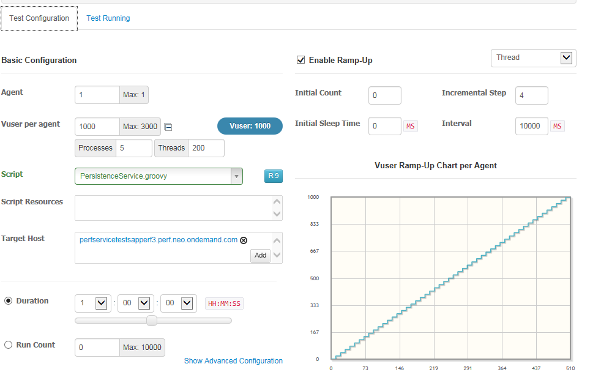

(Ngrinder)


(pinpoint)  
  
여러 좋은 툴이 있지만, 이 2개를 선택한 이유는 **익숙해서**입니다.  
  
Pinpoint는 이미 팀내에서 공식 모니터링툴로 계속해서 사용해오던 상태였으며, Ngrinder는 Spock, Gradle 등으로 Groovy 문법이 눈에 익은 상태여서 테스트 시나리오를 작성하기에 좋은 선택지였습니다.  

> 개인 프로젝트에서도 이 둘을 계속해서 사용해오던 상태였어서 다른 선택지를 굳이 찾을 필요가 없었습니다.

위에서 언급한대로 성능 테스트는 두번 진행했습니다.

1. 레거시 프로시저를 랩핑한 API의 성능 테스트
2. 신규 도메인 모델 API의 성능 테스트
  
특히 1번 테스트가 중요했습니다.  
이제는 신규 구축하는 포인트 시스템에서 모든 요청을 처리해야하는데, **기존에 서비스 별로 나눠처리 했던 프로시저 요청**으로는 정확한 부하 예측이 어려웠기 때문입니다.  
  
그래서 **주말 피크타임 주문수 * 5배**의 TPS를 성능 테스트의 기준으로 정했습니다.  
**포인트 적립과 가용 포인트 조회**가 가장 많은 사용이 있을 것이며, 이 요청은 **주문수에 비례**하기 때문에 주문수를 기준으로 정했습니다.  
  
성능 테스트 방식은 대부분 비슷할것 같습니다.

1. 시나리오 부하 테스트 도구 (JMeter, Ngrinder) 을 이용해 원하는 시나리오와 부하를 결정해 테스트 시작
2. 모니터링 도구 (NewRelic, Pinpoint, AWS CloudWatch)를 통해 **병목 지점 확인**
3. 병목 지점 해결 후 다시 1 ~ 2 수행

Ngrinder에서 다음과 같이 User수와 TPS를 조정하며 부하를 주고,

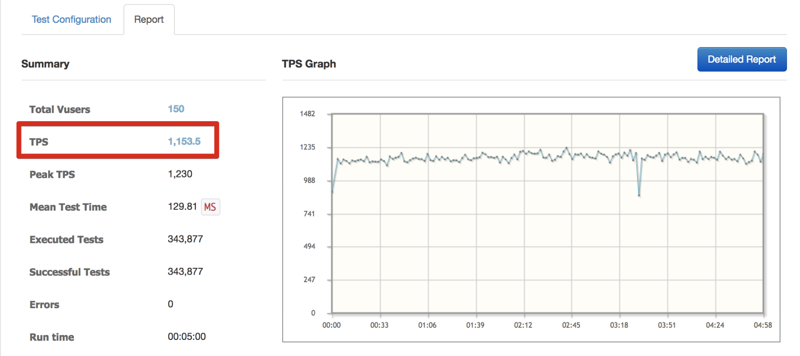

(TPS 1000부터 시작한 것입니다.)  
  
Pinpoint에서는 다음과 같이 각 요청의 응답 중 튀는 것이 있는지, 튄다면 어느 부분에서 많이 소요되었는지, 평균 응답 속도는 얼마나 걸리는지 등등을 확인합니다.  

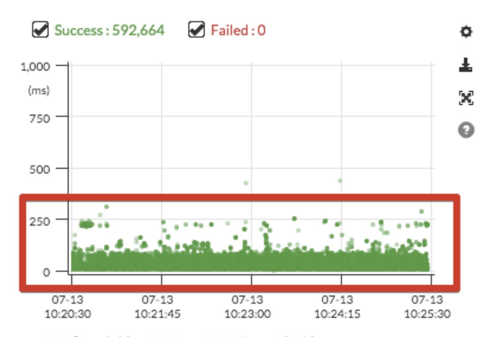

그리고 RDS의 사양은 해당 TPS 기준으로 CPU나 처리되는 쿼리가 얼마나 되는지 등등을 같이 확인합니다.

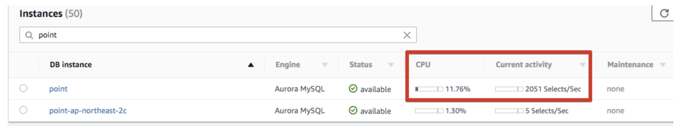

이외에도 다양한 테스트를 진행했습니다.

* **SQS Worker에서 메세지를 초당 처리하는 양**
* Redis 조회 처리 검증

각 **서비스마다의 아키텍처와 도메인에 따라 성능 테스트 시나리오가 다르기 때문에** 꼭 이렇게 검증해야하는 것은 아닙니다.  
  
혹시나 성능 테스트를 전혀 안해보신 분들이라면 성능 테스트에 대한 튜토리얼을 개인 블로그에 작성했으니 한번 참고해보셔도 좋을것 같습니다.

* [성능 튜닝 #1 - DB Connection](https://jojoldu.tistory.com/318)
* [성능 튜닝 #2 - 리눅스 커널 파라미터](https://jojoldu.tistory.com/319)
* [성능 튜닝 #3 - Nginx](https://jojoldu.tistory.com/322)
* [성능 튜닝 #4 - Open Files & tcp_max_tw_buckets](https://jojoldu.tistory.com/323)


### 7-1. 자바 어플리케이션 성능 테스트시 주의 사항

JVM 어플리케이션의 경우 Warm up Time이 존재합니다.

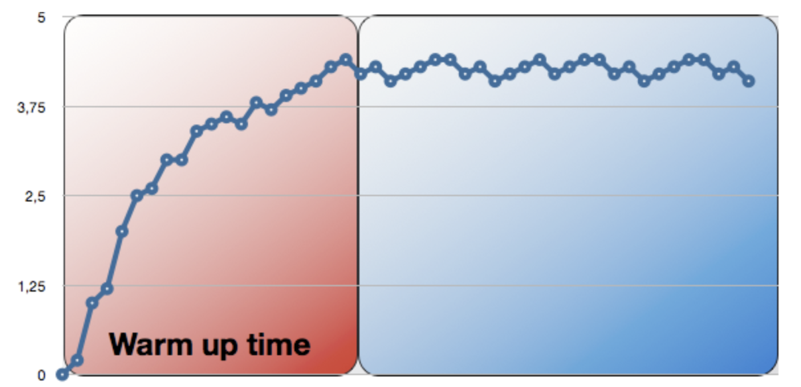

처음 Java 어플리케이션을 실행할 경우 **HotSpot 컴파일러의 최적화 작업으로 성능이 느립니다**.  
이는 성능 테스트시 주의해야할 점인데요.  
**첫번째 테스트 결과만 보면 대부분은 성능이 안좋기 때문**입니다.  
이미 충분히 Warm up한 뒤에 테스트해야만 정상적인 성능 테스트로 볼 수 있습니다.
  
그래서 포인트 시스템의 성능 테스트시 항상 같은 설정으로 **첫번째 테스트는 Warmup용으로 버리고** **2번째 이후 테스트들만 성능 비교**를 하였습니다.  
  
좀 더 자세한 내용을 알고 싶으신 분들은 아래 DZone 기사를 참고해보세요!

* [DZone - why-many-java-performance-test](https://dzone.com/articles/why-many-java-performance-test)


### 7-2. SQS 환경에서 Pinpoint 사용하기

기본적으로 Pinpoint는 HTTP Request가 올때 추적을 시작합니다.  
하지만 SQS와 같은 메세징 큐 서비스를 사용할때는 HTTP Request가 아닙니다.  
그러다보니 **Pinpoint의 기본 설정으로는 추적이 안됩니다**.  
  
Pinpoint에서는 이런 상황을 대비해서 **EntryPoint 설정**이 가능합니다.  

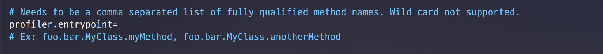

(pinpoint.config)  
  
> entrypoint에는 패키지명을 포함해서 Full Path로 메소드명을 기입해야합니다.  
여러 메소드를 지정해야할 경우 ```,```로 구분해서 등록하시면 됩니다.

위와 같이 설정할 경우 **지정된 메소드가 호출되면 추적**이 시작됩니다.  
저는 ```@SqsListener```가 지정된 메소드들을 모두 entrypoint로 지정했습니다.

```bash
profiler.entrypoint=com.woowabros.point.worker.listener.CommandListener.receiveCommand,com.woowabros.point.worker.listener.CommandListener.receiveCommand.receiveCommandCancel,com.woowabros.point.worker.listener.RefreshListener.receiveRefresh,com.woowabros.point.worker.listener.ExpireListener.receiveExpire
```

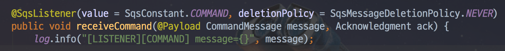

이렇게 설정하게 되면 이제 지정된 메소드가 실행되면 Pinpoint의 추적이 시작됩니다.

> 더 많은 설정 방법은 Pinpoint의 공식 [Document](https://naver.github.io/pinpoint/1.8.0/main.html)를 참고해보세요!
 
### 7-3. RDS R3 vs R4

대략 1억건 정도가 마이그레이션 되었을때, 도메인 모델의 변경이 필요한 것을 발견하였습니다.  
1억건 정도면 사실 엄청나게 많은 양은 아닙니다.  
또한 이전에 IDC에 구축한 DB에서 1억건 정도의 테이블에 Alter를 쳤을때 10분이내로 끝나기도 했어서 바로 ```Alter Table```를 수행했었는데요.  
  
**R4.2xlarge 환경에서 진행했더니 2시간이 지나도 끝나지 않았습니다**.  
  
RDS 사양의 문제인가 싶어 잠깐 최고 사양인 **8xlarge로 올려서 수행해도 전혀 개선이 되지 않았습니다**.  
왜 이런가 싶어 다른 팀의 수석님께 이상한것 같다고 여쭤보니 Cloud Watch를 같이 확인해주셨습니다.  
확인 결과!  
놀랍게도 ```Alter Table```을 수행하는 동안 **굉장히 많은 Network Throughput**이 발생한 것을 발견하였습니다.  


이상하다 싶어 RDS Compare 사이트를 찾아보니 RDS **R3의 경우 로컬 스토리지**를 사용하지만, **R4는 EBS**를 사용하는 것을 확인하였습니다.


([RDS Compare](https://www.ec2instances.info/rds/?min_vcpus=32))  
  

혹시나 싶어 **R3**.2xlarge로 변경 후 ```Alter Table```을 수행하니 10분도 안되서 완료 되었습니다.  
  
테스트로 R3와 R4를 번갈아가며 ```Alter Table```을 수행했는데 여전히 **R4에서는 2시간이상, R3에서는 몇분 이내에** 명령어가 수행되었습니다.  

> 아마도 R4에서는 ```Alter Table```을 하기 위해 원격 저장소와 네트워크 통신을 굉장히 많이 수행하다보니 2시간이 넘게 걸린것 같습니다.  
  
이외에도 몇가지 이슈가 되는 점들이 발견되어, 신규 포인트 시스템은 **R3** 시리즈를 선택해 사용중입니다.  
  
물론 R4의 사양은 R3보다 훨씬 더 좋습니다.  
(위 그림에서 보신것처럼 CPU Processor가 차이 납니다.)  
  
아래는 성능 테스트 중에 두 RDS간의 성능을 비교한 Pinpoint 결과표입니다.


> 명확한 비교를 위해 높은 수치로 테스트를 수행했습니다.  

R3.8xlarge로 **평균 3 ~ 5초** 정도 수행되는 Application이 R4.8xlarge로 수행할 경우 평균 **2 ~ 3초**로 개선되는 것을 확인할 수 있었습니다.  
  
그래서 꼭 R3를 써야하는건 아니고, 상황 및 테스트 결과에 따라 R3와 R4 사이에 선택하시면 좋을것 같습니다.

## 8. QA

QA 역시 성능 테스트와 마찬가지로 **레거시 프로시저 API 버전**과 **신규 도메인 API 버전 2가지를 모두 테스트**했습니다.

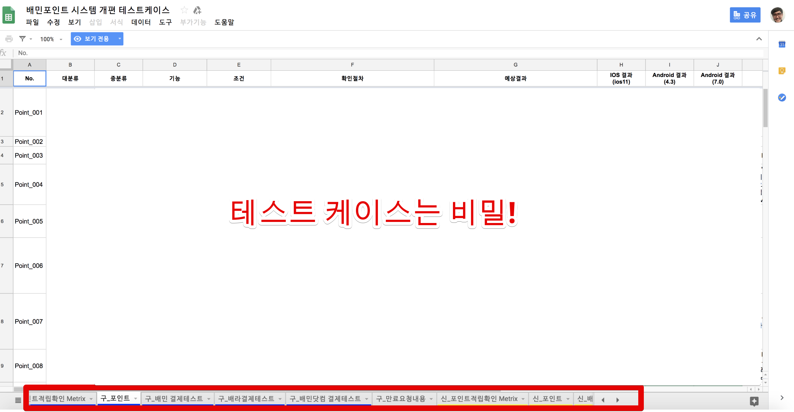

(TC 목록)  
  
이때 QA 분들께 정말 죄송했던 것이, **레거시 API와 신 API를 각각 테스트해야한다는 것을 미리 얘기해드리지 못해** 안그래도 부족했던 QA 일정을 더 촉박하게 만들었던 점입니다.  
그럼에도 불구하고 기간 내에 정말 꼼꼼하게 QA를 완료해주셔서 정말 감사했습니다.  
  
### 8-1. Redis 캐시 갱신 문제

QA 기간 중에, **가끔 가용 포인트가 적립 내역과 다르다**는 내용이 나왔습니다.  
정말 간혹 발생하는 문제라서 **어떤 상황일때 발생하는지 재현**하기가 어려웠습니다.  
몇가지 가설을 세웠습니다.

* 가용포인트 갱신 메세지가 발행되지 않았다.
* 가용포인트 갱신 메세지가 발행은 되었지만, 계산 로직에 문제가 있었다.

두개 경우를 검증하기 위해 Redis에 저장된 메세지를 확인해보니, 실제로 **갱신은 진행** 되었습니다.  
**갱신이 분명히 진행되었는데, 왜 새로 적립된 내용이 계산에 포함되지 않았던걸까** 고민 하던중! 코드에서 큰 문제가 있음을 발견했습니다.  
   
아래와 같이 적립 이벤트를 진행하는 ```earn```메소드에서는 메인 도메인 처리가 끝나고 마지막에 **Redis 이벤트를 수신하는 Redis Worker 로 포인트 갱신 메세지를 발행**합니다.  

```java
public class CommandWorkerService {
    @Transactional
    public void earn(CommandMessage message) {
        
        ...
        /**
            point event, detail 등록
        **/

        ...

        redisSender.sendAvailablePoint(message.getUserId());
        
        ...

    }
}
```

코드를 보시면 바로 아시겠지만, 포인트 적립이 **DB에 반영 되는 것은 트랜잭션이 끝난 시점**입니다.  
Redis Worker로 메세지를 발행하는 것은 **트랜잭션이 반영되기 전**입니다.  
그러다보니 **트랜잭션이 끝나기 전에 Worker에서 메세지를 수신하는 경우가 종종 발생**하고, 그럴 경우에 계산 로직이 수행되면 **아직 DB에는 새로 적립된 포인트가 없기 때문에 누락된 것**입니다.  
  
이 문제를 해결하기 위해서는 **DB에 트랜잭션이 반영된 뒤에, 메세지를 발행**하도록 변경하면 됩니다.  
  
```java
public class CommandWorkerService {
    @Transactional
    public void earn(CommandMessage message) {
        ...

        /**
            point event, detail 등록
        **/

        ...

    }
}

public class CommandListener extends LatchListener {

    @SqsListener(value = SqsConstant.COMMAND, deletionPolicy = SqsMessageDeletionPolicy.NEVER)
    public void receiveCommand(@Payload CommandMessage message, Acknowledgment ack) {
        
        ...

        /**
            Service Method 실행 완료
        **/
        commandWorkerService.earn(message);

        redisSender.sendAvailablePoint(message.getUserId());

        ...
    }
}
```

서비스 메소드에서 메세지 발행을 처리하지 않고, 서비스의 상위인 Listener에서 트랜잭션이 끝난 후, Redis Worker로 메세지를 발행하는 코드로 변경하였습니다.  
  
이렇게 변경후 문제가 더이상 발생되지 않았습니다.

## 9. 오픈

포인트 시스템은 기존에 API가 없었기 때문에 모든 서비스들이 각자 프로시저를 수행하고 있었습니다.  
그래서 가장 먼저 모든 시스템들이 **하나의 End Point를 보도록 전환**하는 것이 최우선 과제 였습니다.
이를 위해서 다음과 같은 구조를 그렸습니다.

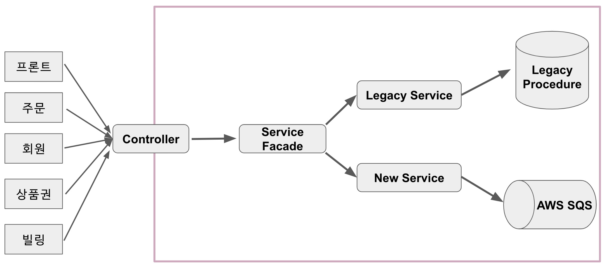

(전체 구조)  
  
그리고 이 구조 안에서 오픈 전략을 세웠습니다.

1. 레거시 프로시저를 랩핑한 API 선 오픈
2. 상품권, 회원, 프론트, 주문, 빌링 서비스에서 차례로 프로시저 호출 코드를 API 코드로 전환해서 배포
3. 레거시 API를 우선순위로 두고, 구 & 신 API 동시에 이벤트 발송하는 API로 전환
4. 신규 API를 우선순위로 두고, 구 & 신 API 동시에 이벤트 발송하는 API로 전환

### 9-1. 레거시 프로시저를 랩핑한 API 오픈

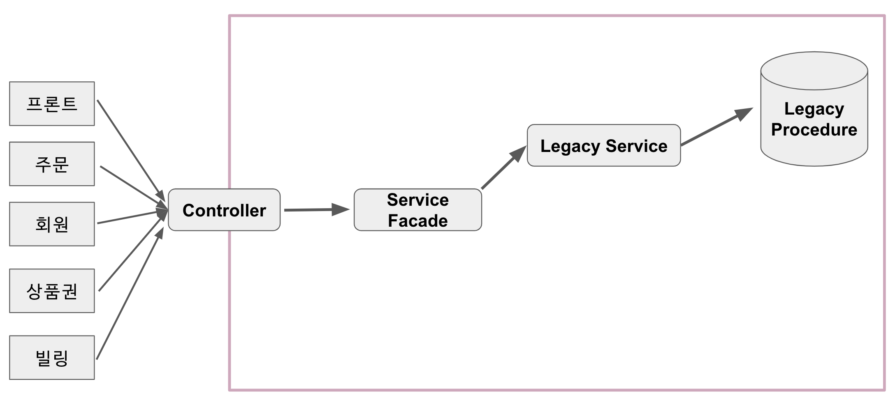

7월 17일 레거시 프로시저를 랩핑한 API를 선 오픈했습니다.  
이때의 오픈은 진짜 개편 오픈이기 보다는, **롤백을 위한 방어선** 느낌의 오픈이였습니다.  
  
신규 도메인, 기능을 전혀 오픈에 포함시키지 않고, **오로지 프로시저를 사용하는 코드들만 전부 API로 감싸서 오픈**했기 때문에 비지니스상 문제가 크게 발생하지는 않았습니다.  
  
그리고 차례로 그동안 **포인트 프로시저를 사용했던 다른 시스템들이 API를 사용하는 패치가 진행**되었습니다.  
  
### 9-2. 레거시 API 우선 순위로 전환

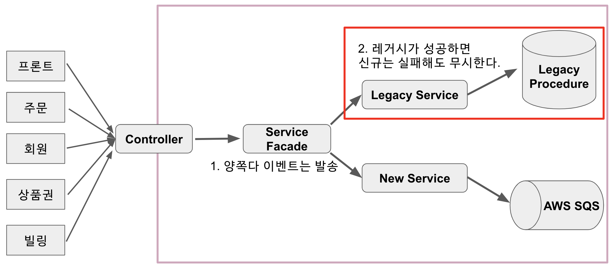

모든 Endpoint가 레거시 API로 전환된 것을 확인하고 더이상의 문제가 없음을 확인 후, 7월 25일 2차 버전인 **레거시 우선순위 API로 전환**했습니다.  
  
이번 버전은 **모든 API에 대한 요청은 기존의 프로시저로 처리**하되, 신규 도메인 API에도 이벤트 메세지를 발송해서 **두 시스템간에 Sync**하는 버전이였습니다.  
  
여기서 한가지 큰 문제점이 있었는데요.  
신규 API를 위해서 **모든 데이터가 신규 도메인으로 마이그레이션 완료** 되어있어야만 했습니다.  
  
이는 신규 포인트 시스템의 도메인이 Insert 모델이라 **이전부터 쌓여있던 데이터들이 있어야만 현재 가용포인트**가 되기 때문인데요.  
  
그러다보니 **시스템 오픈 사이에 쌓이는 데이터들은 어떡하지?** 라는 고민이 있었습니다.  
오픈 시간 동안 쌓인 데이터만 나중에 마이그레이션 하는건 문제가 있었습니다.  
**포인트를 계속 재사용 할 수 있기** 때문입니다.  
  
이 문제를 해결하기 위해 다음과 같은 전략을 세웠습니다.

* 주문 시스템에서는 적립, 취소 관련 이벤트를 **SQS에 적재만 한다**
    * 즉, 적립,취소 등 이벤트가 모두 생성은 됨
    * 적재된 이벤트는 오픈 후 일괄 발송한다.
* **포인트를 사용할 수 있는 유일한 창구**인 빌링 시스템에서는 30분 (오픈 시간)만 차단한다.

이렇게 할 경우 주문, 결제에는 전혀 문제가 없고, **포인트 적립,취소 등도 30분 뒤에는 처리**가 되기 때문에 실제 프로세스와 유사하게 운영할 수 있습니다.  
또한, 오픈 시간 동안 (약 30분) 포인트 시스템에는 전혀 데이터가 추가되지 않기 때문에 깔끔하게 전환 할 수 있습니다.  
  
이 전략으로 포인트 API 전환 오픈을 시작했습니다.

* 7시 포인트 시스템 전환 시작
* 빌링 시스템 포인트 사용 차단, 주문 시스템 SQS에 적재만 하는 모델로 전환
* 마이그레이션 배치를 실행하여 6 ~ 7시 사이에 쌓인 데이터만 마이그레이션
    * 배치 시스템으로 **매 1시간 단위로 마이그레이션을 진행한 상태**
    * 이미 오전 6시까지의 데이터는 모두 마이그레이션 되어 있음
* 6 ~ 7시 데이터 마이그레이션 완료 확인
* 포인트 시스템 전환
* 빌링 시스템 및 주문 시스템 다시 기능 오픈

이번 전환 배포로 모든 포인트 관련 이벤트는 구 DB와 신 DB가 동시에 데이터가 쌓이게 되었고, 마이그레이션은 더이상 사용하지 않아도 되었습니다.  

레거시 우선 순위였기 때문에 **신규 도메인에 문제가 있어도 일단은 무시하고 프로시저 처리**는 진행하도록 두었습니다.  
신규 도메인에 문제가 있다고해서 **운영되고 있는 포인트 적립이나 사용이 안될수는 없기 때문에** 신규 도메인 문제는 모두 예외처리하였습니다.  
대신 실패한 메세지는 로그로 Json 형태 그대로 남기게 하여, **어떤 문제가 있어 실패했는지 확인 후**  다시 SQS로 재전송 하였습니다.  


### 9-3. 신규 API 우선순위로 전환

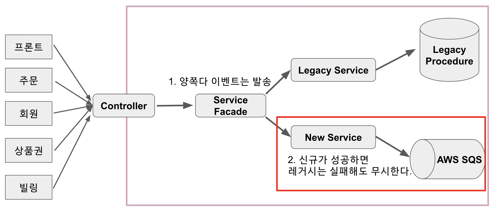

대망의 마지막 전환입니다!
  
7월 30일까지 확인 후, 신규 도메인에서도 문제가 없음을 확인하고 **31일에 신규 API 우선 순위로 전환**하였습니다.  
이때는 신규 도메인이 성공하면 레거시 도메인은 무시하도록 하였습니다.  
대신 **프로시저를 실행은 했습니다**.  

신규 도메인 위주로 전환 되었음에도 레거시 도메인을 일정 기간 유지한 이유는 기존에 사용되던 월 집계 통계 데이터 등등에서 레거시 도메인과 신규 도메인을 비교 & 검증하기 위함이였습니다.  
  
신규 도메인으로 모든 포인트 처리가 되는 것을 확인하고, 기존 레거시를 바라보던 모든 코드를 제거했습니다.  
  
그리고 포인트 시스템이 완전히 개편되었습니다!  


(드디어 끝!!)


## 마무리

신규 포인트 시스템이 일정내에 오픈하는데 있어 가장 중요했던 것은 **다른 팀의 전폭적인 지지와 지원**이였습니다.  
  
다른 팀 역시 굉장히 바쁜 상황임에도 포인트 시스템 오픈에 맞춰 프로시저 호출 코드를 모두 API코드로 전환해주셨습니다.  
  
저희가 다소 급하게 일정을 요청했음에도 기간내에 완료해주시고 배포까지 해주셔서 정말 감사할 따름입니다.  

오픈 뒤에 아시아 올림픽 축구 경기가 있었습니다!  
올림픽은 겪지 못했지만, 아시아 올림픽 축구 경기 역시 많은 주문이 발생했고, 그만큼 포인트 요청도 많았었는데요.  
장애나 응답 지연 없이 아주 깔끔하게 신규 포인트 시스템은 이벤트에 대응을 하였습니다.  
3개월간 스트레스 받고 고민했던 일들이 아주 잘 마무리 되어서 너무나 상쾌했습니다.


부족함이 많은 글임에도 끝까지 읽어주셔서 감사합니다.
그럼, 다음에 또 뵙겠습니다.
감사합니다!


(사용된 모든 짤은 레진코믹스의 레바툰입니다.)
